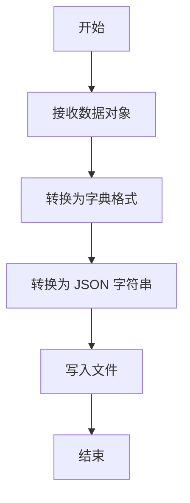
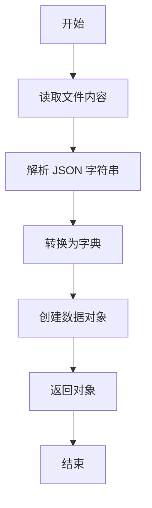
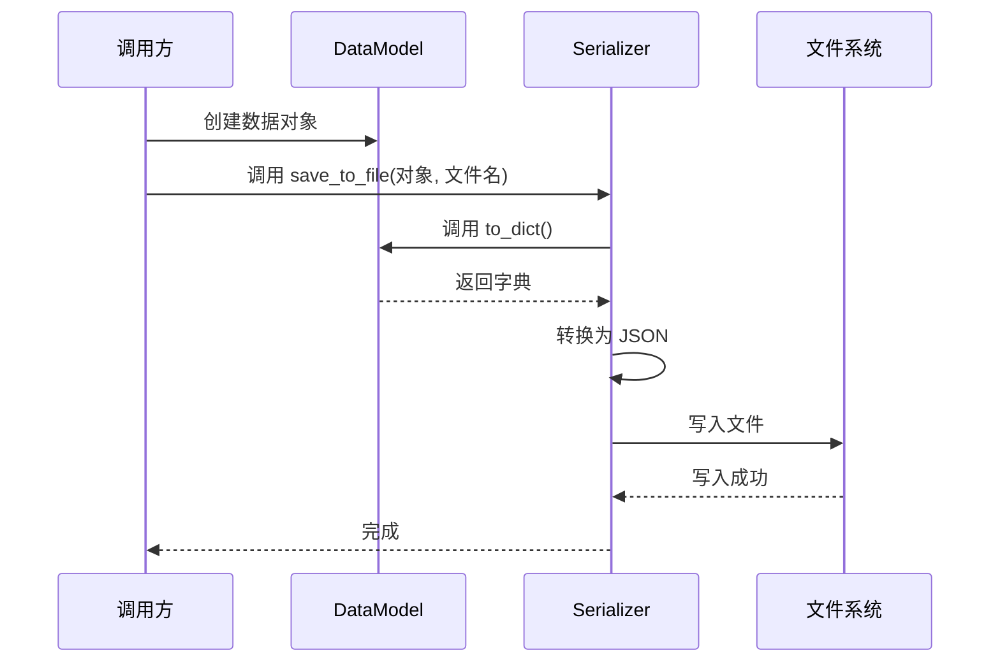
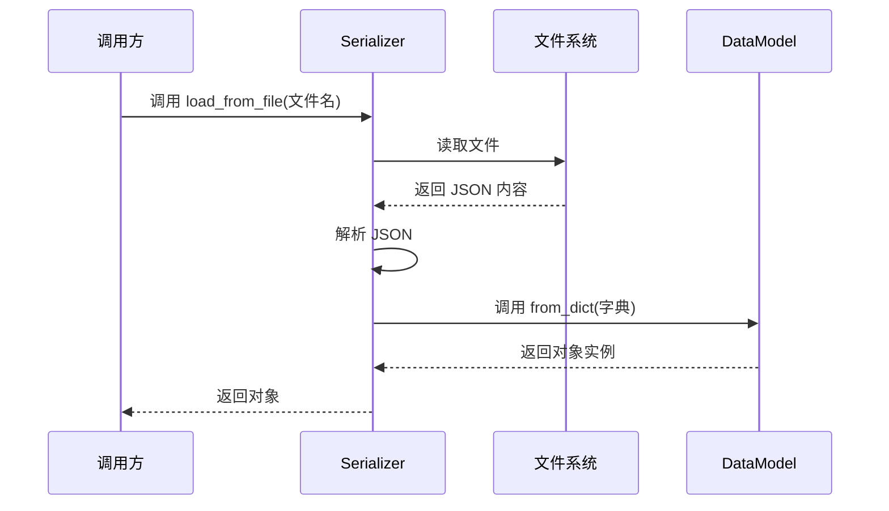
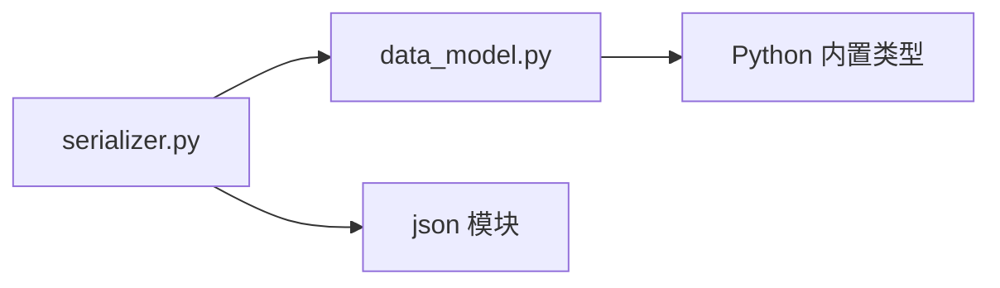

# Python 序列化功能设计文档

## 需求概述

创建两个简单的 Python 文件，实现基础的数据序列化功能，用于将 Python 对象保存到文件并从文件中恢复。

## 目标文件

### 文件 1: data_model.py
**用途**: 定义需要序列化的数据模型

**职责**:
- 定义一个简单的数据类
- 包含基本的数据字段
- 提供数据的基本表示方法

**数据结构设计**:

| 字段名 | 类型 | 说明 |
|--------|------|------|
| name | 字符串 | 名称 |
| value | 数字 | 数值 |
| tags | 列表 | 标签列表 |

### 文件 2: serializer.py
**用途**: 实现序列化和反序列化工具函数

**职责**:
- 提供将对象保存到文件的功能
- 提供从文件加载对象的功能
- 使用 JSON 格式进行序列化

## 功能设计

### 序列化功能流程

### 反序列化功能流程

## 接口设计

### 数据模型类

**类名**: DataModel

**属性**:
| 属性名 | 类型 | 说明 |
|--------|------|------|
| name | str | 数据名称 |
| value | int/float | 数据值 |
| tags | list | 标签列表 |

**方法**:
| 方法名 | 参数 | 返回值 | 说明 |
|--------|------|--------|------|
| to_dict | 无 | dict | 将对象转换为字典 |
| from_dict | dict | DataModel | 从字典创建对象（类方法） |

### 序列化工具函数

**函数**: save_to_file

**参数**:
| 参数名 | 类型 | 说明 |
|--------|------|------|
| obj | DataModel | 要保存的对象 |
| filename | str | 文件路径 |

**返回值**: 无

**行为**: 将对象序列化并保存到指定文件

---

**函数**: load_from_file

**参数**:
| 参数名 | 类型 | 说明 |
|--------|------|------|
| filename | str | 文件路径 |

**返回值**: DataModel 对象

**行为**: 从文件读取并反序列化为对象

## 数据格式

### JSON 存储格式

存储在文件中的 JSON 数据结构：

| 字段 | 类型 | 示例值 | 说明 |
|------|------|--------|------|
| name | string | "示例数据" | 数据名称 |
| value | number | 100 | 数据数值 |
| tags | array | ["tag1", "tag2"] | 标签数组 |

## 使用流程

### 保存数据流程

### 加载数据流程

## 异常处理策略

### 异常场景与处理方式

| 异常场景 | 处理方式 |
|----------|----------|
| 文件不存在 | 抛出 FileNotFoundError 异常 |
| JSON 解析失败 | 抛出 ValueError 异常 |
| 文件写入失败 | 抛出 IOError 异常 |
| 无效的数据格式 | 抛出 ValueError 异常 |

## 设计原则

- **简单性**: 使用 Python 标准库 json 模块，无需第三方依赖
- **可读性**: 使用 JSON 格式，便于人工查看和调试
- **独立性**: 两个文件职责清晰，数据模型与序列化逻辑分离
- **易用性**: 提供简洁的函数接口，调用方式直观

## 文件依赖关系

## 使用示例说明

典型使用场景的抽象描述：

1. **创建数据**: 调用方创建 DataModel 实例，设置 name、value、tags 属性
2. **保存数据**: 调用 save_to_file 函数，传入对象和目标文件路径
3. **加载数据**: 调用 load_from_file 函数，传入文件路径，获得对象实例
4. **使用数据**: 通过对象的属性访问数据内容
