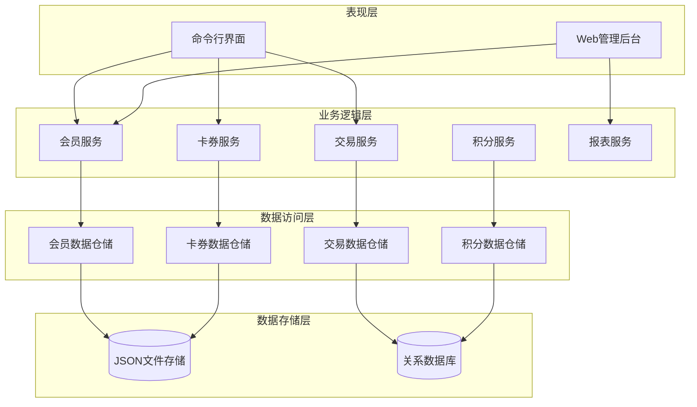
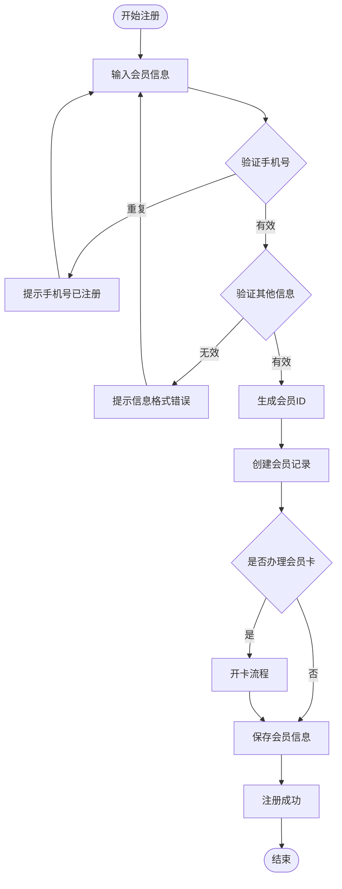
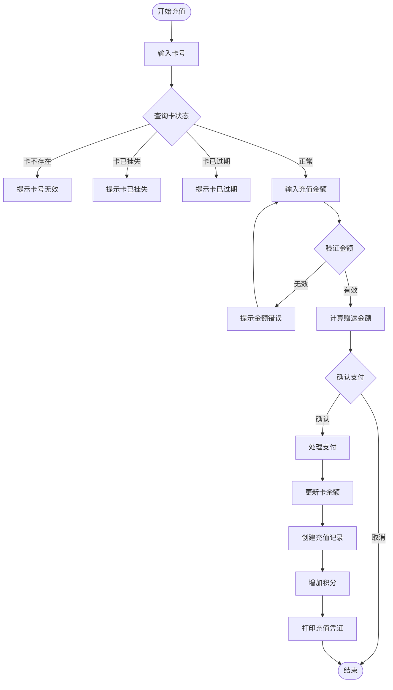
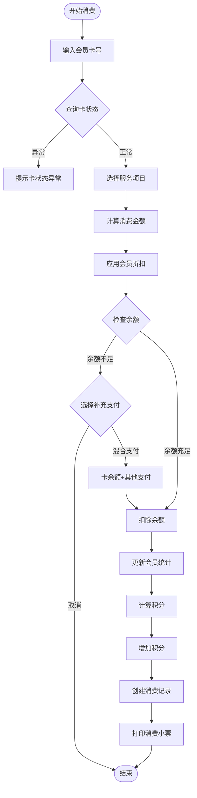
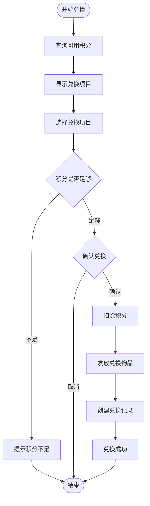
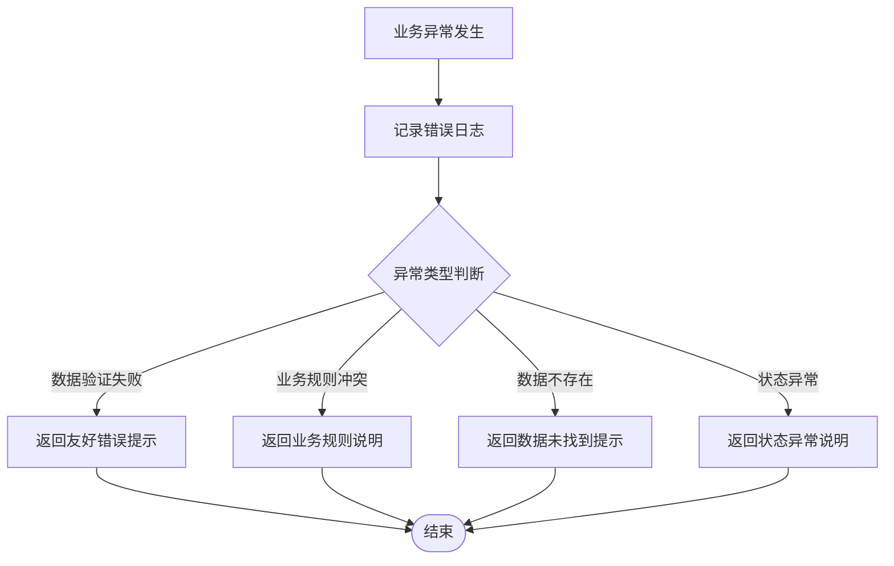

# 理发店会员系统设计文档

## 1. 概述

### 1.1 系统目标
理发店会员系统旨在为理发店提供完整的会员管理解决方案，支持会员注册、储值、消费记录、积分管理、优惠活动等核心功能，帮助理发店提升客户忠诚度和经营效率。

### 1.2 核心价值
- **客户管理**：统一管理会员信息，建立完整的客户档案
- **储值消费**：支持会员预充值和消费扣款，提升资金周转
- **积分激励**：通过积分体系激励客户复购
- **数据洞察**：分析会员消费行为，支持精准营销
- **运营效率**：自动化会员服务流程，减少人工成本

### 1.3 目标用户
- **店长/管理员**：管理会员数据、设置优惠规则、查看经营报表
- **前台收银员**：办理会员卡、处理充值和消费
- **技师**：查看预约信息、记录服务项目
- **会员客户**：查询余额、消费记录、积分情况

## 2. 系统架构

### 2.1 整体架构设计

### 2.2 模块划分

| 模块名称 | 职责描述 | 核心功能 |
|---------|---------|---------|
| **会员管理模块** | 管理会员基本信息和生命周期 | 会员注册、信息修改、会员等级管理 |
| **卡券管理模块** | 管理会员卡和优惠券 | 开卡、充值、挂失、解挂、优惠券发放 |
| **交易管理模块** | 处理所有交易流程 | 消费扣款、充值到账、退款处理 |
| **积分管理模块** | 积分累积和兑换 | 积分累积规则、积分兑换、积分过期 |
| **预约管理模块** | 服务预约和排班 | 预约登记、技师排班、预约提醒 |
| **报表分析模块** | 数据统计和分析 | 会员统计、消费分析、营收报表 |
| **数据持久化模块** | 数据存储和读写 | JSON文件读写、数据备份、数据迁移 |
| **工具模块** | 通用工具函数 | 数据验证、时间处理、格式化工具 |

## 3. 数据模型设计

### 3.1 会员实体模型

| 字段名称 | 数据类型 | 必填 | 说明 | 示例值 |
|---------|---------|-----|------|-------|
| member_id | 字符串 | 是 | 会员唯一标识 | M20250001 |
| name | 字符串 | 是 | 会员姓名 | 张三 |
| phone | 字符串 | 是 | 手机号（唯一） | 13800138000 |
| gender | 字符串 | 否 | 性别 | 男/女 |
| birthday | 日期 | 否 | 生日 | 1990-01-01 |
| register_date | 时间戳 | 是 | 注册日期 | 2025-01-15 10:30:00 |
| member_level | 字符串 | 是 | 会员等级 | 普通/银卡/金卡/钻石 |
| total_consumption | 数值 | 是 | 累计消费金额 | 1580.50 |
| visit_count | 整数 | 是 | 到店次数 | 15 |
| last_visit_date | 时间戳 | 否 | 最后到店时间 | 2025-01-20 14:00:00 |
| status | 字符串 | 是 | 会员状态 | 正常/冻结/注销 |
| remark | 字符串 | 否 | 备注信息 | VIP客户，喜欢王师傅剪发 |

### 3.2 会员卡实体模型

| 字段名称 | 数据类型 | 必填 | 说明 | 示例值 |
|---------|---------|-----|------|-------|
| card_id | 字符串 | 是 | 卡号（唯一） | C20250001 |
| member_id | 字符串 | 是 | 关联会员ID | M20250001 |
| card_type | 字符串 | 是 | 卡类型 | 储值卡/次卡/套餐卡 |
| balance | 数值 | 是 | 卡内余额 | 500.00 |
| total_recharge | 数值 | 是 | 累计充值金额 | 2000.00 |
| remaining_times | 整数 | 否 | 剩余次数（次卡） | 5 |
| open_date | 时间戳 | 是 | 开卡日期 | 2025-01-15 10:30:00 |
| expire_date | 日期 | 否 | 到期日期 | 2026-01-15 |
| status | 字符串 | 是 | 卡状态 | 正常/挂失/冻结/过期 |
| discount_rate | 数值 | 否 | 折扣率 | 0.85（8.5折） |

### 3.3 消费记录实体模型

| 字段名称 | 数据类型 | 必填 | 说明 | 示例值 |
|---------|---------|-----|------|-------|
| transaction_id | 字符串 | 是 | 交易流水号 | T202501150001 |
| member_id | 字符串 | 是 | 会员ID | M20250001 |
| card_id | 字符串 | 是 | 使用的卡号 | C20250001 |
| transaction_type | 字符串 | 是 | 交易类型 | 消费/充值/退款 |
| service_items | 列表 | 否 | 服务项目清单 | [{name: "剪发", price: 50}] |
| original_amount | 数值 | 是 | 原价 | 50.00 |
| discount_amount | 数值 | 是 | 优惠金额 | 7.50 |
| final_amount | 数值 | 是 | 实付金额 | 42.50 |
| payment_method | 字符串 | 是 | 支付方式 | 会员卡/现金/微信/支付宝 |
| operator | 字符串 | 是 | 操作员 | 收银员A |
| technician | 字符串 | 否 | 服务技师 | 王师傅 |
| points_earned | 整数 | 是 | 获得积分 | 42 |
| transaction_time | 时间戳 | 是 | 交易时间 | 2025-01-20 14:30:00 |
| remark | 字符串 | 否 | 备注 | 客户满意 |

### 3.4 积分记录实体模型

| 字段名称 | 数据类型 | 必填 | 说明 | 示例值 |
|---------|---------|-----|------|-------|
| point_id | 字符串 | 是 | 积分记录ID | P202501150001 |
| member_id | 字符串 | 是 | 会员ID | M20250001 |
| point_type | 字符串 | 是 | 积分类型 | 消费获得/签到/兑换消耗/过期扣除 |
| points | 整数 | 是 | 积分变动（正负） | +50 或 -100 |
| related_transaction | 字符串 | 否 | 关联交易ID | T202501150001 |
| point_time | 时间戳 | 是 | 积分变动时间 | 2025-01-20 14:30:00 |
| expire_date | 日期 | 否 | 积分过期日期 | 2026-01-20 |
| remark | 字符串 | 否 | 备注 | 消费满100送50积分 |

### 3.5 预约记录实体模型

| 字段名称 | 数据类型 | 必填 | 说明 | 示例值 |
|---------|---------|-----|------|-------|
| appointment_id | 字符串 | 是 | 预约ID | A202501150001 |
| member_id | 字符串 | 是 | 会员ID | M20250001 |
| service_type | 字符串 | 是 | 服务类型 | 剪发/烫发/染发 |
| technician | 字符串 | 是 | 指定技师 | 王师傅 |
| appointment_time | 时间戳 | 是 | 预约时间 | 2025-01-21 10:00:00 |
| status | 字符串 | 是 | 预约状态 | 待确认/已确认/已完成/已取消 |
| create_time | 时间戳 | 是 | 创建时间 | 2025-01-20 15:00:00 |
| remark | 字符串 | 否 | 备注 | 客户要求剪短发 |

## 4. 业务逻辑设计

### 4.1 会员注册流程

**业务规则说明**：
- 手机号作为唯一标识，不允许重复注册
- 新注册会员默认为"普通会员"等级
- 会员ID生成规则：M + 年份 + 流水号（如M20250001）
- 注册时可同步办理会员卡，也可稍后办理
- 初始积分为0，累计消费为0

### 4.2 会员充值流程

**充值优惠规则**：

| 充值金额 | 赠送金额 | 实际到账 |
|---------|---------|---------|
| 500元 | 50元 | 550元 |
| 1000元 | 150元 | 1150元 |
| 2000元 | 400元 | 2400元 |
| 5000元 | 1200元 | 6200元 |

**业务规则说明**：
- 单次充值最低金额为100元，最高不限
- 充值金额按1:1比例累积积分
- 赠送金额不累积积分
- 充值成功后立即生效，更新会员卡余额
- 记录充值流水，包含操作员、支付方式等信息

### 4.3 会员消费流程

**会员折扣规则**：

| 会员等级 | 升级条件 | 享受折扣 |
|---------|---------|---------|
| 普通会员 | 新注册 | 无折扣 |
| 银卡会员 | 累计消费满1000元 | 9.5折 |
| 金卡会员 | 累计消费满5000元 | 9折 |
| 钻石会员 | 累计消费满10000元 | 8.5折 |

**积分累积规则**：
- 消费1元累积1积分（不含折扣优惠部分）
- 会员生日当月消费双倍积分
- 特定活动期间可享受积分加倍
- 积分有效期为1年，过期自动清零

### 4.4 积分兑换流程

**积分兑换目录**：

| 兑换项目 | 所需积分 | 说明 |
|---------|---------|------|
| 免费洗发 | 100积分 | 单次使用 |
| 护理套餐8折券 | 300积分 | 有效期30天 |
| 烫染9折券 | 500积分 | 有效期60天 |
| 50元代金券 | 1000积分 | 有效期90天 |
| 精美礼品 | 2000积分 | 实物礼品 |

## 5. 核心服务接口设计

### 5.1 会员服务接口

| 接口名称 | 功能描述 | 输入参数 | 返回结果 |
|---------|---------|---------|---------|
| register_member | 注册新会员 | name, phone, gender, birthday | member对象 或 错误信息 |
| query_member | 查询会员信息 | member_id 或 phone | member对象 或 未找到提示 |
| update_member | 更新会员信息 | member_id, 更新字段字典 | 成功/失败状态 |
| upgrade_member_level | 升级会员等级 | member_id | 新等级 或 不符合条件提示 |
| freeze_member | 冻结会员 | member_id, 原因 | 成功/失败状态 |
| unfreeze_member | 解冻会员 | member_id | 成功/失败状态 |
| query_member_statistics | 查询会员统计 | member_id | 消费统计、积分统计、到店次数等 |

### 5.2 卡券服务接口

| 接口名称 | 功能描述 | 输入参数 | 返回结果 |
|---------|---------|---------|---------|
| open_card | 开通会员卡 | member_id, card_type, initial_amount | card对象 或 错误信息 |
| query_card | 查询卡信息 | card_id 或 member_id | card对象 或 未找到提示 |
| recharge_card | 会员卡充值 | card_id, amount, payment_method | 充值后余额 或 错误信息 |
| consume_card | 会员卡消费 | card_id, amount, service_items | 消费后余额 或 错误信息 |
| report_loss | 挂失会员卡 | card_id | 成功/失败状态 |
| unlock_card | 解除挂失 | card_id | 成功/失败状态 |
| query_balance | 查询卡余额 | card_id | 当前余额、累计充值、累计消费 |

### 5.3 交易服务接口

| 接口名称 | 功能描述 | 输入参数 | 返回结果 |
|---------|---------|---------|---------|
| create_transaction | 创建交易记录 | member_id, transaction_type, amount, details | transaction对象 |
| query_transaction | 查询交易记录 | transaction_id | transaction对象 |
| query_member_transactions | 查询会员交易历史 | member_id, start_date, end_date | 交易记录列表 |
| refund_transaction | 退款处理 | transaction_id, refund_amount, reason | 退款记录 或 错误信息 |
| export_transactions | 导出交易明细 | start_date, end_date, 筛选条件 | 导出文件路径 |

### 5.4 积分服务接口

| 接口名称 | 功能描述 | 输入参数 | 返回结果 |
|---------|---------|---------|---------|
| add_points | 增加积分 | member_id, points, reason | 成功/失败状态 |
| deduct_points | 扣除积分 | member_id, points, reason | 成功/失败状态 |
| query_points | 查询积分余额 | member_id | 当前积分、即将过期积分 |
| query_points_history | 查询积分明细 | member_id, start_date, end_date | 积分变动记录列表 |
| exchange_points | 积分兑换 | member_id, reward_id | 兑换结果 或 错误信息 |
| expire_points | 积分过期处理 | 无（定时任务执行） | 过期积分统计 |

## 6. 数据验证规则

### 6.1 会员信息验证

| 字段 | 验证规则 |
|-----|---------|
| 姓名 | 非空，长度2-20字符，仅包含中英文 |
| 手机号 | 必须符合中国大陆手机号格式（11位，1开头） |
| 性别 | 可选值：男、女 |
| 生日 | 日期格式正确，年龄在0-120岁之间 |
| 会员等级 | 可选值：普通、银卡、金卡、钻石 |

### 6.2 交易金额验证

| 场景 | 验证规则 |
|-----|---------|
| 充值金额 | 必须大于0，最小充值100元，最大单次充值50000元 |
| 消费金额 | 必须大于0，最大单次消费不超过卡余额+10000元（允许混合支付） |
| 退款金额 | 必须大于0且不超过原交易金额 |
| 积分兑换 | 积分必须为正整数，不超过会员可用积分 |

### 6.3 业务状态验证

| 操作 | 前置条件 |
|-----|---------|
| 会员消费 | 会员状态为"正常"，会员卡状态为"正常" |
| 会员卡充值 | 会员卡状态为"正常"（非挂失、非过期） |
| 积分兑换 | 会员状态为"正常"，积分余额充足，兑换项目有效 |
| 会员卡挂失 | 会员卡当前状态为"正常" |
| 退款处理 | 原交易存在且未退款，退款金额合理 |

## 7. 异常处理策略

### 7.1 业务异常

**常见异常处理**：

| 异常类型 | 处理策略 | 用户提示 |
|---------|---------|---------|
| 会员不存在 | 返回空结果 | "未找到该会员信息，请检查会员号或手机号" |
| 手机号重复 | 拒绝注册 | "该手机号已注册，请直接登录或找回会员信息" |
| 余额不足 | 提示补充支付 | "卡余额不足，当前余额XXX元，还需支付XXX元" |
| 积分不足 | 拒绝兑换 | "积分不足，当前积分XXX，需要XXX积分" |
| 卡已挂失 | 拒绝操作 | "该卡已挂失，请先解除挂失或办理新卡" |
| 数据格式错误 | 提示重新输入 | "输入格式有误，请检查XXX字段" |

### 7.2 系统异常

| 异常场景 | 应对措施 |
|---------|---------|
| 文件读写失败 | 记录错误日志，提示用户稍后重试，检查文件权限 |
| 数据损坏 | 从备份恢复，通知管理员处理 |
| 并发冲突 | 使用乐观锁或悲观锁机制，提示用户重新操作 |
| 内存溢出 | 限制单次查询数据量，分批处理大数据集 |

## 8. 报表分析设计

### 8.1 会员统计报表

**会员概况统计**：

| 统计维度 | 计算方式 | 用途 |
|---------|---------|------|
| 会员总数 | 统计所有状态为"正常"的会员数量 | 了解会员规模 |
| 新增会员数 | 统计指定时间段内注册的会员数 | 评估拉新效果 |
| 活跃会员数 | 统计近30天有消费记录的会员数 | 评估会员活跃度 |
| 沉睡会员数 | 统计超过90天无消费的会员数 | 识别需唤醒客户 |
| 会员等级分布 | 按等级统计各级别会员数量和占比 | 了解会员结构 |
| 平均消费金额 | 总消费金额 / 活跃会员数 | 评估客单价 |

**会员消费分析**：

| 分析维度 | 说明 |
|---------|------|
| 消费TOP10会员 | 按累计消费金额降序排列前10名会员 |
| 消费频次TOP10 | 按到店次数降序排列前10名会员 |
| 月度消费趋势 | 按月统计会员消费总额和人次 |
| 服务项目偏好 | 统计各服务项目的消费人次和金额 |

### 8.2 财务报表

**收入统计**：

| 报表项 | 计算方式 |
|-------|---------|
| 当日营收 | 当日所有消费交易的实付金额总和 |
| 当月营收 | 当月所有消费交易的实付金额总和 |
| 充值收入 | 统计时间段内所有充值交易的总金额 |
| 会员卡余额 | 所有正常会员卡的余额总和（预收款） |
| 优惠金额 | 折扣和优惠券导致的金额减免总和 |

**业务趋势**：

| 分析维度 | 说明 |
|---------|------|
| 月度营收对比 | 对比近12个月的营收数据，识别淡旺季 |
| 同比增长率 | 对比去年同期数据，计算增长率 |
| 技师业绩排名 | 统计各技师服务次数和关联消费金额 |
| 支付方式占比 | 统计各支付方式的交易笔数和金额占比 |

## 9. 测试策略

### 9.1 单元测试

**会员服务测试用例**：

| 测试场景 | 测试方法 | 预期结果 |
|---------|---------|---------|
| 正常注册会员 | 输入有效的会员信息 | 成功创建会员，返回会员对象 |
| 重复手机号注册 | 使用已存在的手机号注册 | 注册失败，提示手机号已存在 |
| 无效手机号注册 | 输入格式错误的手机号 | 注册失败，提示手机号格式错误 |
| 查询存在的会员 | 使用有效会员ID查询 | 返回完整的会员信息 |
| 查询不存在的会员 | 使用无效会员ID查询 | 返回空结果或未找到提示 |
| 更新会员信息 | 修改会员的姓名、生日等 | 成功更新，数据持久化 |
| 会员等级自动升级 | 模拟消费达到升级条件 | 会员等级自动提升 |

**卡券服务测试用例**：

| 测试场景 | 测试方法 | 预期结果 |
|---------|---------|---------|
| 开通新卡 | 为会员开通储值卡 | 成功创建会员卡，初始余额正确 |
| 正常充值 | 充值500元 | 余额增加，赠送金额正确，生成充值记录 |
| 余额充足消费 | 消费金额小于卡余额 | 余额正确扣减，生成消费记录，增加积分 |
| 余额不足消费 | 消费金额大于卡余额 | 提示余额不足，可选混合支付 |
| 挂失与解挂 | 执行挂失和解挂操作 | 卡状态正确变更，挂失后拒绝消费 |
| 过期卡消费 | 使用过期卡消费 | 拒绝消费，提示卡已过期 |

**交易服务测试用例**：

| 测试场景 | 测试方法 | 预期结果 |
|---------|---------|---------|
| 创建消费记录 | 提交有效的消费数据 | 成功创建交易记录，流水号唯一 |
| 查询交易历史 | 按会员ID和时间范围查询 | 返回符合条件的交易列表 |
| 退款处理 | 对有效交易执行退款 | 余额返还，生成退款记录 |
| 重复退款 | 对已退款交易再次退款 | 拒绝退款，提示已退款 |
| 导出交易明细 | 指定时间范围导出 | 生成包含所有交易的文件 |

**积分服务测试用例**：

| 测试场景 | 测试方法 | 预期结果 |
|---------|---------|---------|
| 消费增加积分 | 消费100元 | 积分增加100，记录积分明细 |
| 积分兑换 | 使用1000积分兑换代金券 | 积分扣除，发放兑换物品 |
| 积分不足兑换 | 积分少于兑换所需 | 拒绝兑换，提示积分不足 |
| 积分过期处理 | 模拟积分到期日期 | 过期积分自动清零 |
| 查询积分明细 | 按时间范围查询 | 返回积分变动历史 |

### 9.2 集成测试

**端到端业务流程测试**：

**测试验证点**：
- 会员信息正确存储和查询
- 会员卡余额计算准确（充值500+赠送50=550，消费100剩450）
- 积分累积正确（消费100得100积分，消费200得200积分）
- 会员等级根据累计消费自动升级
- 积分兑换后余额正确扣除
- 所有交易记录完整保存

### 9.3 边界测试

| 测试项 | 边界值 | 预期行为 |
|-------|-------|---------|
| 充值金额最小值 | 99元 | 拒绝充值，提示最低100元 |
| 充值金额最小值 | 100元 | 充值成功 |
| 手机号长度 | 10位 | 验证失败 |
| 手机号长度 | 11位 | 验证通过 |
| 会员姓名长度 | 1个字符 | 验证失败 |
| 会员姓名长度 | 2个字符 | 验证通过 |
| 会员姓名长度 | 20个字符 | 验证通过 |
| 会员姓名长度 | 21个字符 | 验证失败 |
| 积分余额 | 0积分兑换 | 拒绝兑换 |
| 卡余额 | 0元消费 | 拒绝消费或使用其他支付 |
