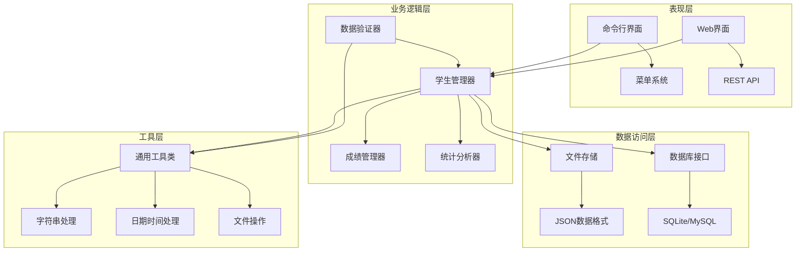
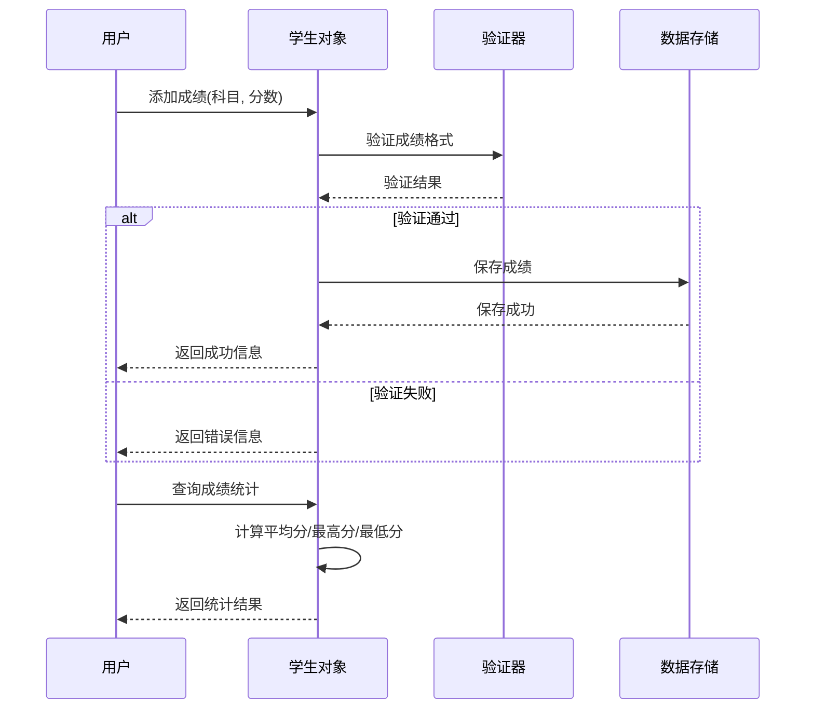
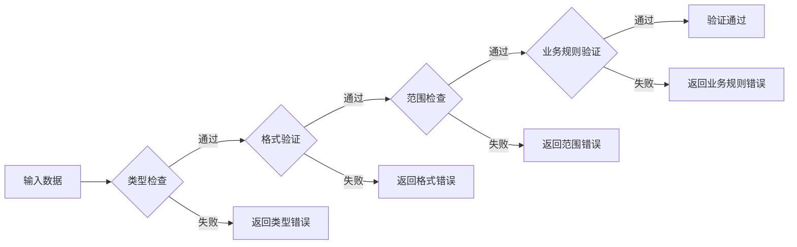
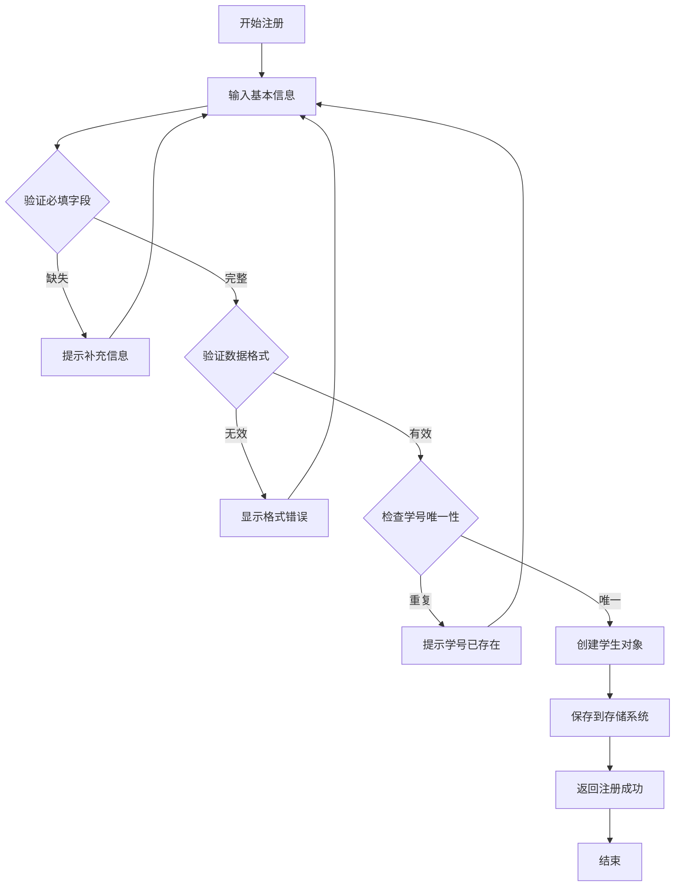
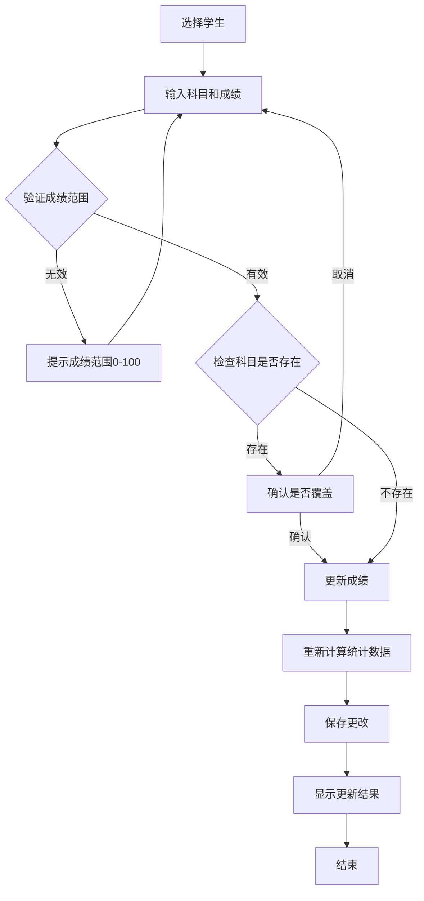
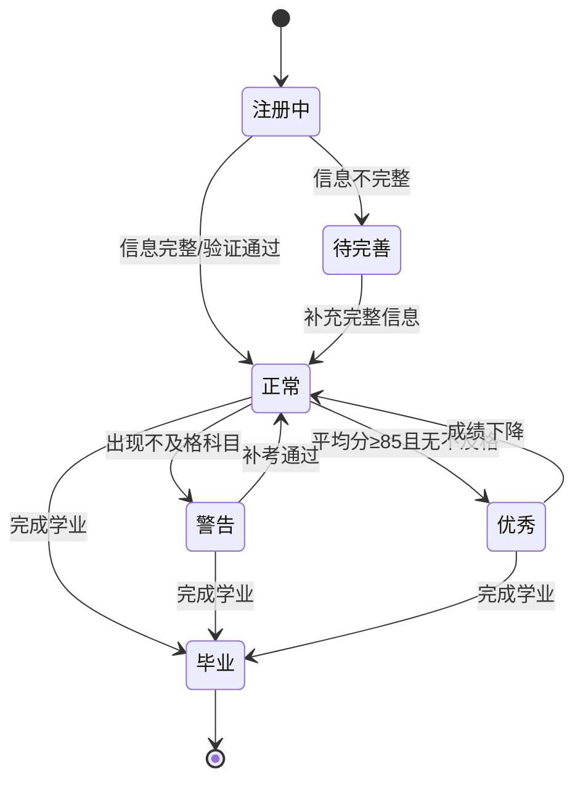
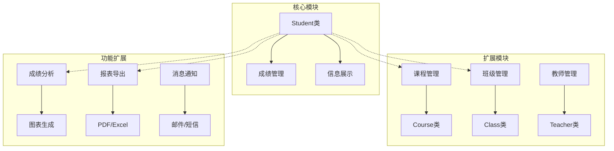
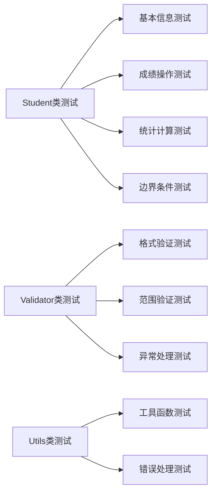

# 学生管理系统设计文档

## 概述

### 系统描述
学生管理系统是一个基于Python的教育管理应用，旨在为教育机构提供全面的学生信息管理、成绩统计和学业分析功能。系统采用面向对象设计，具备良好的扩展性和维护性。

### 核心价值
- **信息集中化管理**：统一管理学生基本信息、成绩记录和学业表现
- **数据可视化分析**：提供多维度的成绩统计和学业分析
- **自动化评估**：智能判断学生学业状态和表现等级
- **灵活的数据验证**：确保数据准确性和系统稳定性

### 目标用户
- 教务管理员
- 班主任和任课教师
- 学生和家长（查询功能）

## 技术架构

### 核心技术栈
- **开发语言**：Python 3.8+
- **核心依赖**：标准库（datetime, typing, re, json, os）
- **数据存储**：文件系统（可扩展为数据库）
- **架构模式**：分层架构 + 面向对象设计

### 系统架构

## 核心功能模块

### 学生信息管理

#### 数据模型

| 字段名 | 类型 | 必填 | 描述 | 验证规则 |
|--------|------|------|------|----------|
| name | str | 是 | 学生姓名 | 长度1-20字符 |
| age | int | 是 | 年龄 | 0-150范围 |
| student_id | str | 是 | 学号 | 格式：年份+序号(如2021001) |
| major | str | 否 | 专业 | 长度0-50字符 |
| scores | Dict[str, float] | 否 | 成绩字典 | 科目名-分数映射 |
| created_time | datetime | 自动 | 创建时间 | 系统自动生成 |

#### 功能描述

**学生信息CRUD操作**
- 创建学生档案：验证必填字段和数据格式
- 查询学生信息：支持按学号、姓名模糊查询
- 更新学生信息：支持批量和单字段更新
- 删除学生档案：软删除机制，保留历史记录

**信息展示格式化**
- 详细信息视图：包含基本信息、成绩统计、学业状态
- 简要信息视图：用于列表展示
- 导出功能：支持JSON、CSV格式导出

### 成绩管理系统

#### 成绩操作流程

#### 成绩分析功能

| 分析维度 | 计算方法 | 返回值类型 | 用途 |
|----------|----------|------------|------|
| 平均成绩 | 所有科目成绩总和/科目数量 | float | 综合评价 |
| 最高成绩 | 找出分数最高的科目 | tuple(科目, 分数) | 优势学科识别 |
| 最低成绩 | 找出分数最低的科目 | tuple(科目, 分数) | 薄弱环节识别 |
| 及格统计 | 统计>=60分的科目 | List[str] | 及格率分析 |
| 不及格统计 | 统计<60分的科目 | List[str] | 需要改进的科目 |
| 优秀判定 | 平均分>=85且无不及格科目 | bool | 学业水平评定 |

### 数据验证模块

#### 验证规则体系

#### 验证器功能矩阵

| 验证类型 | 验证函数 | 适用场景 | 错误处理 |
|----------|----------|----------|----------|
| 空值检查 | is_empty() | 所有必填字段 | 返回缺失字段列表 |
| 邮箱验证 | is_email() | 联系方式 | 格式错误提示 |
| 手机号验证 | is_phone() | 联系方式 | 格式错误提示 |
| 数值验证 | is_number() | 成绩、年龄 | 类型转换错误 |
| 范围验证 | is_in_range() | 成绩(0-100)、年龄 | 超出范围提示 |
| 长度验证 | is_length_valid() | 姓名、专业 | 长度限制提示 |
| 学号验证 | validate_student_id() | 学号唯一性 | 格式/重复错误 |

## 业务流程设计

### 学生注册流程

### 成绩录入流程

## 系统状态管理

### 学生状态定义

### 数据一致性保证

| 操作类型 | 一致性策略 | 回滚机制 | 错误恢复 |
|----------|------------|----------|----------|
| 学生创建 | 事务性验证 | 验证失败时不创建对象 | 重新输入 |
| 成绩更新 | 原子性操作 | 更新失败时恢复原值 | 错误提示并重试 |
| 数据删除 | 软删除标记 | 保留删除前状态 | 支持恢复操作 |
| 批量操作 | 分批处理 | 失败批次独立回滚 | 部分成功处理 |

## 扩展性设计

### 模块化架构

### 接口抽象设计

| 接口类型 | 接口名称 | 核心方法 | 扩展用途 |
|----------|----------|----------|----------|
| 存储接口 | IStorage | save(), load(), delete() | 支持不同存储方式 |
| 验证接口 | IValidator | validate(), get_errors() | 自定义验证规则 |
| 导出接口 | IExporter | export(), format() | 多种导出格式 |
| 通知接口 | INotifier | send(), notify() | 消息推送机制 |

### 配置管理策略

| 配置项 | 默认值 | 可配置性 | 配置方式 |
|--------|--------|----------|----------|
| 及格分数线 | 60.0 | 高 | 配置文件/界面设置 |
| 优秀学生阈值 | 85.0 | 高 | 配置文件/界面设置 |
| 学号格式规则 | 年份+3位序号 | 中 | 配置文件 |
| 数据存储路径 | ./data/ | 高 | 环境变量/配置文件 |
| 日志级别 | INFO | 高 | 配置文件 |

## 测试策略

### 单元测试设计

### 测试用例矩阵

| 测试模块 | 测试场景 | 预期结果 | 边界条件 |
|----------|----------|----------|----------|
| 学生创建 | 正常信息输入 | 成功创建对象 | 最小/最大长度值 |
| 成绩添加 | 有效成绩范围 | 成功添加成绩 | 0分、100分、负数、超限值 |
| 成绩统计 | 多科目计算 | 正确统计结果 | 无成绩、单科目、大量科目 |
| 数据验证 | 各种输入格式 | 正确验证结果 | 空值、特殊字符、超长字符串 |

### 性能测试指标

| 性能指标 | 目标值 | 测试方法 | 优化策略 |
|----------|--------|----------|----------|
| 学生创建响应时间 | <100ms | 批量创建测试 | 对象池、缓存机制 |
| 成绩查询响应时间 | <50ms | 大数据量查询 | 索引优化、分页加载 |
| 内存使用效率 | <100MB(1000学生) | 内存监控工具 | 对象复用、垃圾回收 |
| 数据持久化性能 | <200ms | 文件I/O测试 | 批量写入、异步处理 |