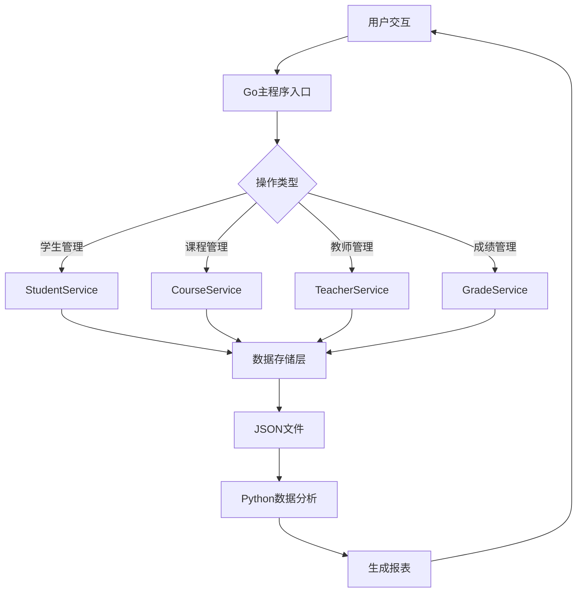
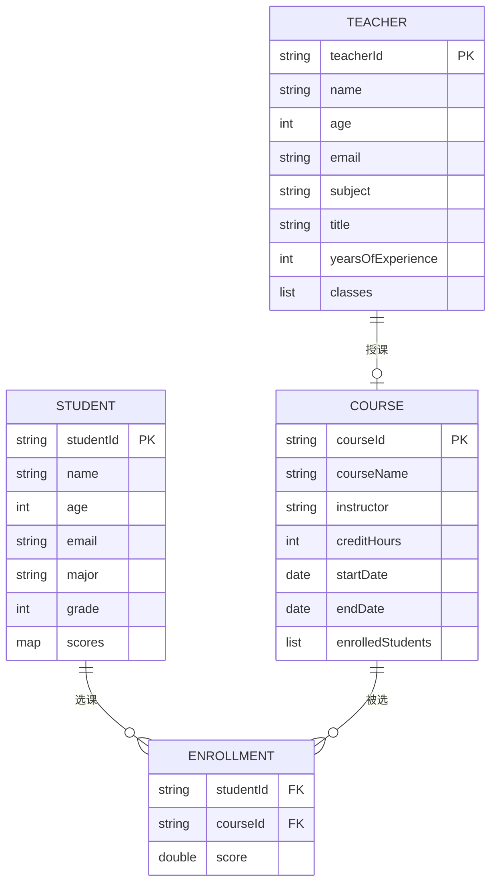
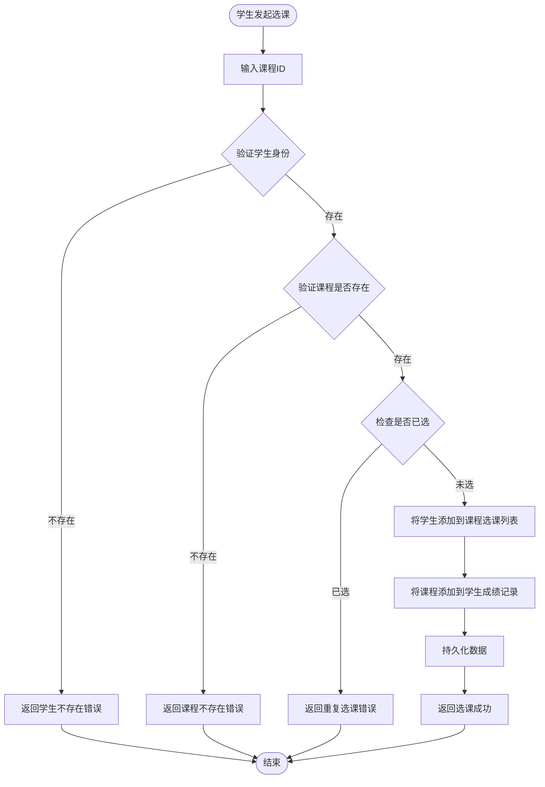
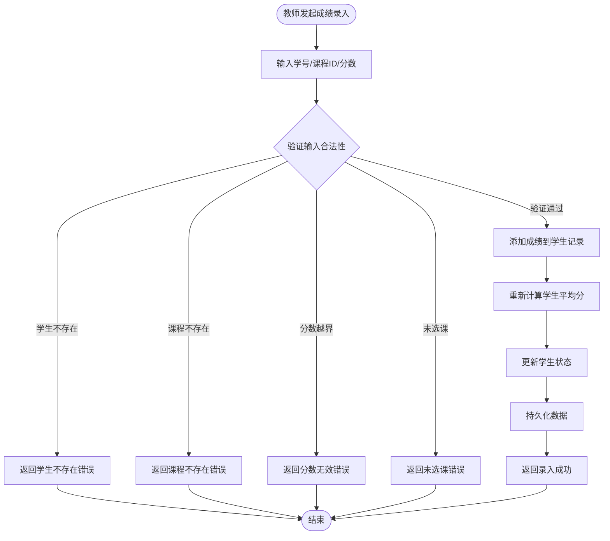
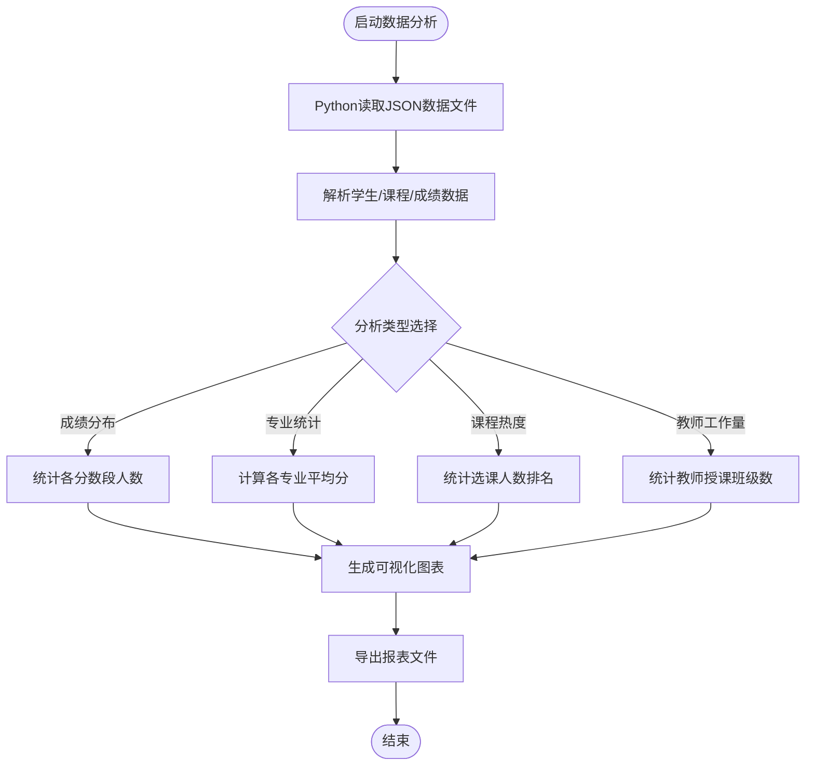

# 学生管理系统设计文档

## 1. 系统概述

### 1.1 系统定位
学生管理系统是一个轻量级的教务管理应用,基于现有的多语言项目架构(Java + Python + Go),提供学生信息、课程选课、成绩管理等核心功能。

### 1.2 设计原则
- 充分利用现有实体类(Student、Teacher、Course)
- 遵循多语言协作模式:Java负责实体与业务逻辑,Python处理数据分析与报表,Go作为主控程序
- 采用简洁的架构设计,避免过度工程化
- 支持文件持久化存储,便于部署和测试

### 1.3 核心价值
- 实现学生信息的完整生命周期管理
- 提供课程选课与成绩管理能力
- 支持教师授课信息管理
- 生成数据分析报表辅助决策

## 2. 功能需求

### 2.1 学生管理
- 学生信息的创建、查询、修改、删除
- 支持按学号、姓名、专业、年级等条件查询
- 学生成绩记录与统计
- 优秀学生识别(平均分≥85分)

### 2.2 课程管理
- 课程信息的创建、查询、修改、删除
- 课程选课人数统计
- 学生选课与退课操作
- 课程容量控制

### 2.3 教师管理
- 教师信息的创建、查询、修改
- 教师授课班级分配
- 资深教师识别(教龄≥10年)

### 2.4 成绩管理
- 录入学生各科成绩
- 计算学生平均分
- 判断课程通过状态(成绩≥60分)
- 统计通过课程数量

### 2.5 数据分析与报表
- 生成学生成绩分布报表
- 统计各专业平均分
- 分析课程选课热度
- 导出教师工作量报表

## 3. 系统架构

### 3.1 整体架构

系统采用三层架构设计,各层职责如下:

```
表现层(Go主控程序)
    ↓ 调用
业务逻辑层(Java服务)
    ↓ 读写
数据持久层(JSON文件存储)
    ↓ 分析
数据分析层(Python脚本)
```

### 3.2 架构流程图



### 3.3 模块职责划分

| 模块 | 技术栈 | 职责说明 |
|------|--------|----------|
| 主控程序 | Go | 提供命令行交互界面,协调各服务调用,处理用户输入输出 |
| 实体层 | Java | 定义Student、Teacher、Course等实体类及其业务方法 |
| 服务层 | Java | 实现StudentService、CourseService等业务逻辑 |
| 存储层 | Java | 提供JSON文件读写能力,实现数据持久化 |
| 分析层 | Python | 读取数据文件,执行统计分析,生成可视化报表 |

## 4. 数据模型

### 4.1 学生实体(Student)

| 属性名 | 类型 | 说明 | 约束 |
|--------|------|------|------|
| studentId | 字符串 | 学号 | 唯一标识,非空 |
| name | 字符串 | 姓名 | 非空 |
| age | 整数 | 年龄 | 范围:15-30 |
| email | 字符串 | 邮箱 | 符合邮箱格式 |
| major | 字符串 | 专业 | 非空 |
| grade | 整数 | 年级 | 范围:1-4 |
| scores | 映射 | 课程成绩 | 键为课程名,值为分数(0-100) |

**核心行为**:
- 添加课程成绩:验证分数范围后存入scores映射
- 计算平均分:对所有成绩求和后除以课程数量
- 判断优秀学生:平均分≥85时返回真
- 统计通过课程:筛选成绩≥60的课程数量

### 4.2 课程实体(Course)

| 属性名 | 类型 | 说明 | 约束 |
|--------|------|------|------|
| courseId | 字符串 | 课程ID | 唯一标识,非空 |
| courseName | 字符串 | 课程名称 | 非空 |
| instructor | 字符串 | 授课教师 | 非空 |
| creditHours | 整数 | 学分 | 范围:1-8 |
| description | 字符串 | 课程描述 | 可选 |
| startDate | 日期 | 开始日期 | 非空 |
| endDate | 日期 | 结束日期 | 必须晚于开始日期 |
| enrolledStudents | 列表 | 已选学生ID列表 | 默认为空列表 |

**核心行为**:
- 学生选课:检查学生是否已选,若未选则添加到列表
- 学生退课:从已选学生列表中移除指定学生
- 统计选课人数:返回已选学生列表长度
- 检查学生是否已选:判断学生ID是否在列表中

### 4.3 教师实体(Teacher)

| 属性名 | 类型 | 说明 | 约束 |
|--------|------|------|------|
| teacherId | 字符串 | 教师ID | 唯一标识,非空 |
| name | 字符串 | 姓名 | 非空 |
| age | 整数 | 年龄 | 范围:25-70 |
| email | 字符串 | 邮箱 | 符合邮箱格式 |
| subject | 字符串 | 所教科目 | 非空 |
| title | 字符串 | 职称 | 枚举:助教/讲师/副教授/教授 |
| yearsOfExperience | 整数 | 教龄 | 范围:0-50 |
| classes | 列表 | 授课班级列表 | 默认为空列表 |

**核心行为**:
- 添加授课班级:检查班级是否已存在,不重复添加
- 移除授课班级:从列表中移除指定班级
- 判断资深教师:教龄≥10年时返回真
- 判断高级职称:职称为副教授或教授时返回真

### 4.4 实体关系图



## 5. 业务流程

### 5.1 学生选课流程



### 5.2 成绩录入流程



### 5.3 数据分析流程



## 6. 服务接口设计

### 6.1 学生服务接口(StudentService)

| 接口方法 | 输入参数 | 输出结果 | 功能描述 |
|----------|----------|----------|----------|
| createStudent | Student对象 | 操作结果(成功/失败) | 创建新学生记录,验证学号唯一性 |
| getStudentById | studentId(字符串) | Student对象或空 | 根据学号查询学生信息 |
| updateStudent | Student对象 | 操作结果 | 更新学生信息,保持学号不变 |
| deleteStudent | studentId(字符串) | 操作结果 | 删除学生记录及相关选课信息 |
| searchStudents | 查询条件(专业/年级/姓名) | Student列表 | 按条件搜索学生 |
| getExcellentStudents | 无 | Student列表 | 获取所有优秀学生(平均分≥85) |
| addStudentScore | studentId, courseId, score | 操作结果 | 为学生添加课程成绩 |
| getStudentAverage | studentId | 平均分(浮点数) | 计算学生平均分 |

### 6.2 课程服务接口(CourseService)

| 接口方法 | 输入参数 | 输出结果 | 功能描述 |
|----------|----------|----------|----------|
| createCourse | Course对象 | 操作结果 | 创建新课程,验证课程ID唯一性 |
| getCourseById | courseId(字符串) | Course对象或空 | 根据课程ID查询课程信息 |
| updateCourse | Course对象 | 操作结果 | 更新课程信息 |
| deleteCourse | courseId(字符串) | 操作结果 | 删除课程及相关选课记录 |
| enrollStudent | courseId, studentId | 操作结果 | 学生选课操作 |
| dropStudent | courseId, studentId | 操作结果 | 学生退课操作 |
| getEnrolledStudents | courseId | Student列表 | 获取课程已选学生列表 |
| getCoursesByInstructor | teacherId | Course列表 | 查询教师授课列表 |

### 6.3 教师服务接口(TeacherService)

| 接口方法 | 输入参数 | 输出结果 | 功能描述 |
|----------|----------|----------|----------|
| createTeacher | Teacher对象 | 操作结果 | 创建新教师记录 |
| getTeacherById | teacherId(字符串) | Teacher对象或空 | 根据教师ID查询信息 |
| updateTeacher | Teacher对象 | 操作结果 | 更新教师信息 |
| deleteTeacher | teacherId(字符串) | 操作结果 | 删除教师记录 |
| assignClass | teacherId, className | 操作结果 | 为教师分配授课班级 |
| removeClass | teacherId, className | 操作结果 | 移除教师授课班级 |
| getSeniorTeachers | 无 | Teacher列表 | 获取资深教师列表(教龄≥10年) |
| getTeacherWorkload | teacherId | 班级数量(整数) | 获取教师授课班级数量 |

### 6.4 成绩服务接口(GradeService)

| 接口方法 | 输入参数 | 输出结果 | 功能描述 |
|----------|----------|----------|----------|
| recordGrade | studentId, courseId, score | 操作结果 | 录入学生成绩,验证选课关系 |
| updateGrade | studentId, courseId, score | 操作结果 | 更新已有成绩 |
| getStudentGrades | studentId | 成绩列表 | 获取学生所有成绩 |
| getCourseGrades | courseId | 成绩列表 | 获取课程所有学生成绩 |
| calculateAverage | studentId | 平均分(浮点数) | 计算学生平均分 |
| getPassedCourses | studentId | Course列表 | 获取学生已通过课程列表 |
| getFailedCourses | studentId | Course列表 | 获取学生未通过课程列表 |
| getCoursePassRate | courseId | 通过率(百分比) | 计算课程通过率 |

## 7. 数据持久化设计

### 7.1 存储策略

系统采用JSON文件存储,数据文件结构如下:

- `students.json` - 存储所有学生信息
- `courses.json` - 存储所有课程信息
- `teachers.json` - 存储所有教师信息
- `enrollments.json` - 存储选课关系

### 7.2 数据文件结构示例

**students.json结构**:
```
{
  "students": [
    {
      "studentId": "学号字符串",
      "name": "姓名字符串",
      "age": 年龄整数,
      "email": "邮箱字符串",
      "major": "专业字符串",
      "grade": 年级整数,
      "scores": {
        "课程ID1": 分数1,
        "课程ID2": 分数2
      }
    }
  ]
}
```

**courses.json结构**:
```
{
  "courses": [
    {
      "courseId": "课程ID字符串",
      "courseName": "课程名称字符串",
      "instructor": "教师ID字符串",
      "creditHours": 学分整数,
      "description": "描述字符串",
      "startDate": "YYYY-MM-DD格式日期",
      "endDate": "YYYY-MM-DD格式日期",
      "enrolledStudents": ["学生ID1", "学生ID2"]
    }
  ]
}
```

**teachers.json结构**:
```
{
  "teachers": [
    {
      "teacherId": "教师ID字符串",
      "name": "姓名字符串",
      "age": 年龄整数,
      "email": "邮箱字符串",
      "subject": "科目字符串",
      "title": "职称字符串",
      "yearsOfExperience": 教龄整数,
      "classes": ["班级1", "班级2"]
    }
  ]
}
```

### 7.3 数据访问层接口

| 接口方法 | 功能描述 |
|----------|----------|
| loadStudents() | 从students.json加载所有学生数据到内存 |
| saveStudents() | 将内存中学生数据持久化到students.json |
| loadCourses() | 从courses.json加载所有课程数据到内存 |
| saveCourses() | 将内存中课程数据持久化到courses.json |
| loadTeachers() | 从teachers.json加载所有教师数据到内存 |
| saveTeachers() | 将内存中教师数据持久化到teachers.json |
| backupData() | 创建所有数据文件的备份副本 |
| restoreData() | 从备份文件恢复数据 |

## 8. 数据分析与报表

### 8.1 分析功能列表

| 分析功能 | 输入数据 | 输出结果 | 实现语言 |
|----------|----------|----------|----------|
| 学生成绩分布统计 | students.json | 各分数段人数柱状图 | Python |
| 专业平均分排名 | students.json | 专业平均分排序表格 | Python |
| 课程选课热度分析 | courses.json | 选课人数TOP10课程列表 | Python |
| 教师工作量统计 | teachers.json | 教师授课班级数排名 | Python |
| 优秀学生名单 | students.json | 平均分≥85的学生清单 | Python |
| 课程通过率统计 | students.json, courses.json | 各课程通过率表格 | Python |

### 8.2 报表生成流程

数据分析模块通过以下步骤生成报表:

1. **数据加载阶段**: Python脚本读取JSON数据文件到内存
2. **数据清洗阶段**: 验证数据完整性,过滤无效记录
3. **数据计算阶段**: 执行统计计算(求和、平均、排序等)
4. **可视化阶段**: 使用matplotlib生成图表(如有需要)
5. **报表导出阶段**: 将结果输出为文本文件或CSV格式

### 8.3 Python分析模块职责

| 模块文件 | 主要职责 |
|----------|----------|
| data_processor.py | 读取JSON文件,解析数据结构,数据清洗与转换 |
| report_generator.py | 生成各类统计报表,格式化输出 |
| validator.py | 验证数据完整性与合法性 |
| utils.py | 提供通用工具函数(日期处理、文件操作等) |

## 9. 用户交互设计

### 9.1 主菜单结构

系统启动后展示如下主菜单:

```
========== 学生管理系统 ==========
1. 学生管理
2. 课程管理
3. 教师管理
4. 成绩管理
5. 数据分析与报表
0. 退出系统
==================================
请选择功能编号:
```

### 9.2 学生管理子菜单

```
---------- 学生管理 ----------
1. 添加学生
2. 查询学生
3. 修改学生信息
4. 删除学生
5. 查看优秀学生
6. 返回主菜单
------------------------------
请选择操作:
```

### 9.3 课程管理子菜单

```
---------- 课程管理 ----------
1. 添加课程
2. 查询课程
3. 修改课程信息
4. 删除课程
5. 查看选课学生
6. 返回主菜单
------------------------------
请选择操作:
```

### 9.4 成绩管理子菜单

```
---------- 成绩管理 ----------
1. 录入成绩
2. 修改成绩
3. 查询学生成绩
4. 查询课程成绩
5. 学生选课
6. 学生退课
7. 返回主菜单
------------------------------
请选择操作:
```

### 9.5 数据分析子菜单

```
---------- 数据分析与报表 ----------
1. 生成成绩分布报表
2. 生成专业统计报表
3. 生成课程热度报表
4. 生成教师工作量报表
5. 导出所有报表
6. 返回主菜单
-----------------------------------
请选择操作:
```

## 10. 异常处理策略

### 10.1 输入验证规则

| 输入类型 | 验证规则 | 错误提示 |
|----------|----------|----------|
| 学号/教师ID/课程ID | 非空,长度≤20字符,仅字母数字 | "ID格式无效,请使用字母数字组合" |
| 姓名 | 非空,长度2-50字符 | "姓名长度必须在2-50字符之间" |
| 年龄(学生) | 整数,范围15-30 | "学生年龄必须在15-30岁之间" |
| 年龄(教师) | 整数,范围25-70 | "教师年龄必须在25-70岁之间" |
| 邮箱 | 符合标准邮箱格式 | "邮箱格式无效" |
| 专业 | 非空,长度≤30字符 | "专业名称不能为空且不超过30字符" |
| 年级 | 整数,范围1-4 | "年级必须在1-4之间" |
| 学分 | 整数,范围1-8 | "学分必须在1-8之间" |
| 成绩 | 浮点数,范围0-100 | "成绩必须在0-100分之间" |
| 日期 | YYYY-MM-DD格式,结束日期晚于开始日期 | "日期格式错误或日期范围无效" |

### 10.2 业务异常处理

| 异常场景 | 处理策略 |
|----------|----------|
| 学号重复 | 拒绝创建,提示"学号已存在,请使用其他学号" |
| 课程ID重复 | 拒绝创建,提示"课程ID已存在,请使用其他ID" |
| 学生未选课即录成绩 | 拒绝录入,提示"学生未选该课程,请先选课" |
| 重复选课 | 拒绝操作,提示"学生已选该课程,无需重复选课" |
| 删除已有选课的课程 | 先清空选课记录,再删除课程,提示用户影响范围 |
| 删除已授课的教师 | 需先解除授课关系,提示"请先移除教师的授课班级" |
| 数据文件不存在 | 自动创建空数据文件,初始化空数据结构 |
| 数据文件损坏 | 尝试从备份恢复,若无备份则提示用户手动修复 |

### 10.3 系统异常处理

| 异常类型 | 处理方式 |
|----------|----------|
| 文件读写失败 | 记录错误日志,提示用户检查文件权限 |
| JSON解析失败 | 提示数据文件格式错误,建议恢复备份 |
| 内存不足 | 提示数据量过大,建议分批处理 |
| 外部脚本调用失败 | 记录错误信息,提示检查Python环境配置 |

## 11. 系统状态管理

### 11.1 数据一致性保障

系统通过以下机制确保数据一致性:

- **原子操作**: 每次数据修改作为一个整体执行,要么全部成功要么全部失败
- **事务性写入**: 先写入临时文件,验证成功后再替换原文件
- **关联数据同步**: 删除学生时同步清理相关选课记录,删除课程时同步清理学生成绩记录
- **数据校验**: 数据加载后立即执行完整性校验,发现异常及时告警

### 11.2 并发控制策略

由于系统采用单机文件存储,需防止并发写入冲突:

- **文件锁机制**: 写入操作前获取文件锁,写入完成后释放
- **顺序操作**: 同一时刻仅允许一个写操作执行
- **读写分离**: 读操作不阻塞,写操作互斥执行

### 11.3 数据备份机制

| 备份类型 | 触发时机 | 保留策略 |
|----------|----------|----------|
| 自动备份 | 每次数据修改操作前 | 保留最近3个版本 |
| 手动备份 | 用户主动触发 | 永久保留,需用户手动删除 |
| 定时备份 | 每日凌晨2点(如系统运行) | 保留最近7天备份 |

## 12. 部署与运行

### 12.1 目录结构

```
/Qoder2
├── main.go                    # Go主程序入口
├── Student.java               # 学生实体类
├── Teacher.java               # 教师实体类
├── Course.java                # 课程实体类
├── StudentService.java        # 学生服务类(待实现)
├── CourseService.java         # 课程服务类(待实现)
├── TeacherService.java        # 教师服务类(待实现)
├── GradeService.java          # 成绩服务类(待实现)
├── DataStorage.java           # 数据存储类(待实现)
├── data_processor.py          # 数据处理脚本
├── report_generator.py        # 报表生成脚本
├── validator.py               # 数据验证脚本
├── utils.py                   # 工具函数脚本
├── data/                      # 数据文件目录
│   ├── students.json
│   ├── courses.json
│   ├── teachers.json
│   └── backups/               # 备份文件目录
├── reports/                   # 报表输出目录
└── deploy-to-server.sh        # 部署脚本
```

### 12.2 运行流程

系统运行流程如下:

1. **初始化阶段**: Go主程序启动,加载配置,检查数据文件完整性
2. **菜单交互**: 展示主菜单,等待用户输入操作指令
3. **服务调用**: 根据用户选择调用对应的Java服务方法
4. **数据操作**: 服务层执行业务逻辑,通过存储层读写JSON文件
5. **结果反馈**: 将操作结果返回给Go主程序,展示给用户
6. **报表生成**: 用户触发分析功能时,Go调用Python脚本生成报表
7. **循环执行**: 返回主菜单,继续等待下一次操作

### 12.3 部署说明

使用现有的`deploy-to-server.sh`脚本进行部署:

- 脚本负责将系统文件打包
- 上传到远程测试服务器
- 配置运行环境(Java、Python、Go)
- 初始化数据目录结构
- 启动主程序

## 13. 扩展性设计

### 13.1 功能扩展点

系统预留以下扩展点以支持未来功能增强:

| 扩展点 | 扩展方向 | 实现建议 |
|--------|----------|----------|
| 数据存储 | 支持MySQL/PostgreSQL关系数据库 | 抽象DataStorage接口,实现不同存储适配器 |
| 用户认证 | 增加登录与权限管理 | 新增UserService,实现角色权限控制 |
| 数据导入导出 | 支持Excel/CSV批量导入导出 | 扩展Python脚本,使用pandas库处理 |
| 消息通知 | 成绩发布时邮件通知学生 | 新增NotificationService,集成邮件发送 |
| 数据可视化 | Web界面展示统计图表 | 使用Flask/Django提供Web API |

### 13.2 性能优化方向

当数据量增长时,可考虑以下优化:

- **索引机制**: 为学号、课程ID等建立索引,加速查询
- **分页加载**: 大数据量查询时分页返回结果
- **缓存策略**: 常用数据缓存到内存,减少文件读取
- **异步处理**: 报表生成等耗时操作异步执行

### 13.3 架构演进路径

系统可按以下路径演进:

1. **当前阶段**: 单机文件存储,命令行交互
2. **Web化阶段**: 提供HTTP API,支持Web前端访问
3. **微服务化**: 拆分学生、课程、成绩为独立微服务
4. **云原生阶段**: 容器化部署,支持弹性伸缩
