# 超市管理系统设计文档

## 概述

超市管理系统是一个综合性的商业管理平台，旨在为中小型超市提供完整的业务管理解决方案。系统采用模块化设计，支持商品管理、库存控制、销售处理、会员服务、财务统计等核心业务功能。

### 系统目标

- 提供直观易用的商品和库存管理功能
- 实现高效的销售收银和订单处理
- 支持灵活的会员管理和促销策略
- 提供准确的财务报表和业务分析
- 确保数据安全和系统稳定性

### 技术架构

系统采用Python开发，基于面向对象设计模式，使用JSON文件进行数据持久化存储。整体架构参考项目中现有系统的成熟模式，确保代码可维护性和扩展性。

## 系统架构

### 核心架构组件

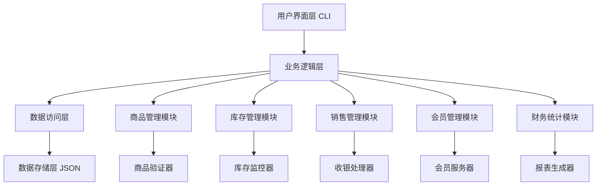

### 数据流架构

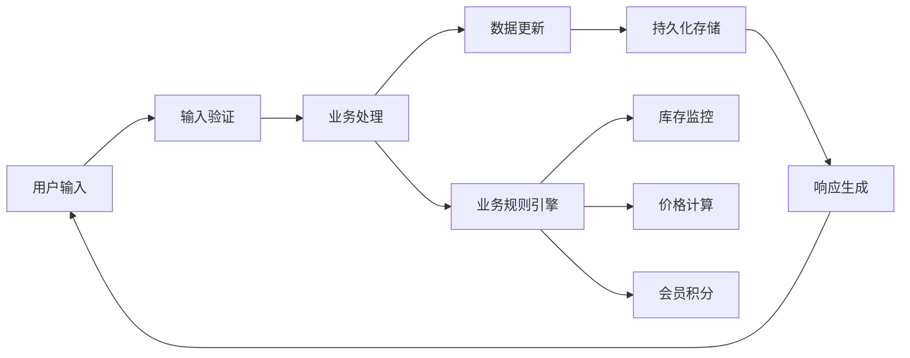

## 功能模块设计

### 商品管理模块

负责商品信息的全生命周期管理，包括商品的创建、更新、删除和查询功能。

#### 商品数据模型

| 字段名称 | 数据类型 | 描述 | 约束条件 |
|---------|---------|------|---------|
| product_id | String | 商品编码 | 唯一标识，格式：P + 6位数字 |
| name | String | 商品名称 | 必填，长度1-100字符 |
| category | String | 商品分类 | 必填，预定义分类列表 |
| brand | String | 品牌名称 | 可选，长度1-50字符 |
| unit_price | Decimal | 单价 | 必填，大于0，精确到分 |
| cost_price | Decimal | 成本价 | 必填，大于0，精确到分 |
| unit | String | 计量单位 | 必填，如：个、kg、L等 |
| barcode | String | 条形码 | 可选，唯一标识 |
| description | String | 商品描述 | 可选，最大500字符 |
| supplier_id | String | 供应商ID | 可选，关联供应商信息 |
| created_time | DateTime | 创建时间 | 自动生成 |
| updated_time | DateTime | 更新时间 | 自动维护 |
| status | String | 商品状态 | active/inactive/discontinued |

#### 商品分类体系

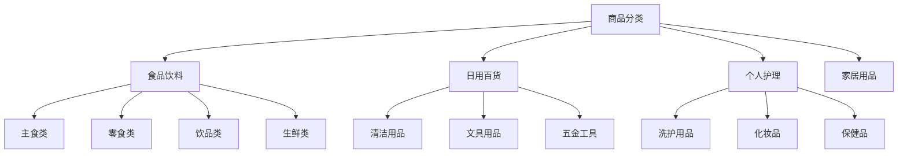

### 库存管理模块

实现商品库存的精确控制和监控，支持进货、出货、盘点、预警等功能。

#### 库存数据模型

| 字段名称 | 数据类型 | 描述 | 约束条件 |
|---------|---------|------|---------|
| product_id | String | 商品ID | 外键关联商品表 |
| current_stock | Integer | 当前库存 | 非负整数 |
| min_stock | Integer | 最低库存 | 大于等于0 |
| max_stock | Integer | 最高库存 | 大于min_stock |
| reserved_stock | Integer | 预留库存 | 非负整数，已下单未发货 |
| last_restock_date | DateTime | 最后进货日期 | 可空 |
| last_restock_quantity | Integer | 最后进货数量 | 可空 |
| total_sold | Integer | 累计销量 | 统计字段 |
| location | String | 存放位置 | 可选，货架位置信息 |

#### 库存操作流程

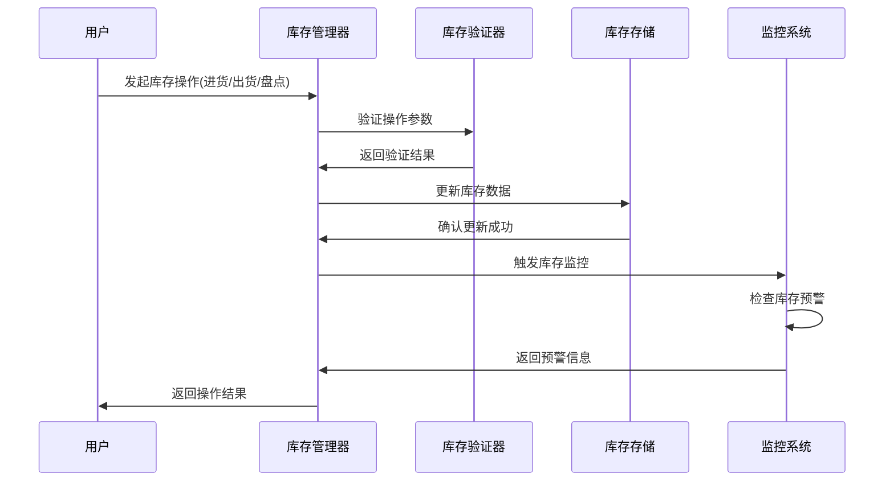

### 销售管理模块

处理商品销售的完整流程，包括购物车管理、订单生成、支付处理、小票打印等功能。

#### 销售订单数据模型

| 字段名称 | 数据类型 | 描述 | 约束条件 |
|---------|---------|------|---------|
| order_id | String | 订单号 | 唯一标识，格式：O + 时间戳 |
| order_date | DateTime | 订单日期 | 自动生成 |
| cashier_id | String | 收银员ID | 必填 |
| member_id | String | 会员ID | 可选，非会员为空 |
| items | Array | 商品明细 | 至少包含一个商品 |
| subtotal | Decimal | 商品小计 | 计算得出 |
| discount_amount | Decimal | 折扣金额 | 默认0 |
| tax_amount | Decimal | 税费 | 根据税率计算 |
| total_amount | Decimal | 订单总额 | 最终支付金额 |
| payment_method | String | 支付方式 | cash/card/mobile/mixed |
| payment_status | String | 支付状态 | pending/completed/refunded |
| points_earned | Integer | 获得积分 | 会员专享 |
| points_used | Integer | 使用积分 | 会员专享 |

#### 销售流程设计

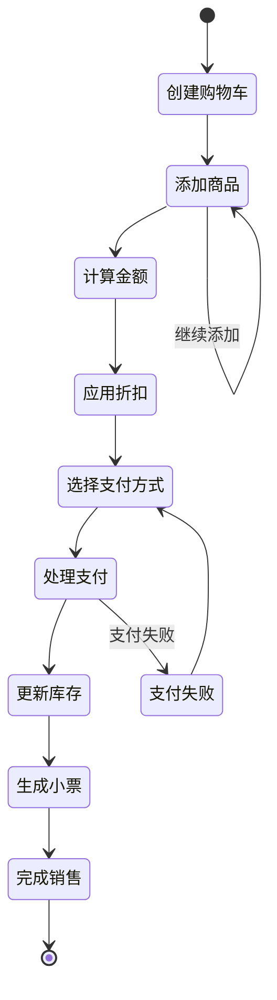

### 会员管理模块

提供完整的会员服务体系，包括会员注册、等级管理、积分系统、促销活动等功能。

#### 会员数据模型

| 字段名称 | 数据类型 | 描述 | 约束条件 |
|---------|---------|------|---------|
| member_id | String | 会员ID | 唯一标识，格式：M + 8位数字 |
| name | String | 会员姓名 | 必填，实名制 |
| phone | String | 手机号码 | 必填，唯一，用于登录 |
| email | String | 邮箱地址 | 可选，接收促销信息 |
| birthday | Date | 生日 | 可选，生日优惠 |
| gender | String | 性别 | 可选，male/female/other |
| registration_date | DateTime | 注册日期 | 自动生成 |
| member_level | String | 会员等级 | bronze/silver/gold/platinum |
| total_points | Integer | 总积分 | 累计获得积分 |
| available_points | Integer | 可用积分 | 当前可使用积分 |
| total_spent | Decimal | 累计消费 | 统计字段 |
| last_visit_date | DateTime | 最后访问 | 记录活跃度 |
| status | String | 账户状态 | active/inactive/suspended |

#### 会员等级权益体系

| 等级 | 消费门槛 | 积分倍率 | 专属折扣 | 生日特权 | 其他权益 |
|------|---------|---------|---------|---------|---------|
| 青铜会员 | 0元 | 1倍 | 无 | 生日9.5折 | 新人礼包 |
| 白银会员 | 1000元 | 1.2倍 | 部分商品9.5折 | 生日9折 | 会员日优惠 |
| 黄金会员 | 5000元 | 1.5倍 | 全场9.5折 | 生日8.5折 | 专属客服 |
| 白金会员 | 20000元 | 2倍 | 全场9折 | 生日8折 | VIP通道 |

### 财务统计模块

提供全面的财务报表和业务分析功能，支持多维度的数据统计和趋势分析。

#### 报表类型设计

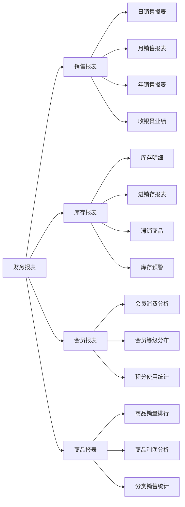

#### 关键绩效指标(KPI)

| 指标名称 | 计算方式 | 分析维度 | 更新频率 |
|---------|---------|---------|---------|
| 日均销售额 | 总销售额 ÷ 营业天数 | 日/周/月对比 | 实时 |
| 商品周转率 | 销售成本 ÷ 平均库存 | 按商品/分类 | 日更新 |
| 客单价 | 总销售额 ÷ 交易笔数 | 按时间段/会员等级 | 实时 |
| 毛利率 | (销售额-成本) ÷ 销售额 | 按商品/分类/时间 | 实时 |
| 会员复购率 | 重复购买会员数 ÷ 总会员数 | 按月/季度 | 月更新 |
| 库存周转天数 | 平均库存 ÷ 日均销售量 | 按商品/分类 | 日更新 |

## 用户界面设计

### 主菜单结构

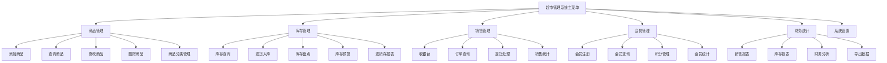

### 收银台界面流程

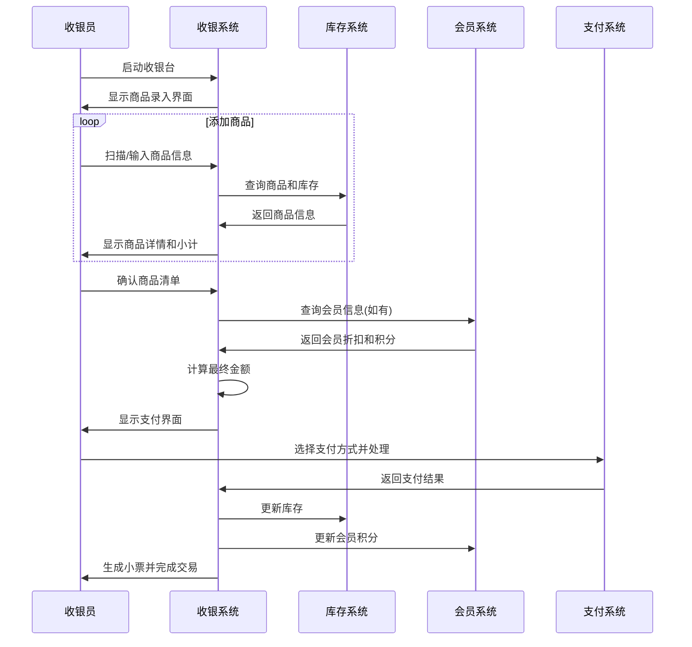

## 数据管理

### 数据存储结构

系统采用JSON文件分别存储不同模块的数据，确保数据的独立性和安全性。

#### 主要数据文件

| 文件名称 | 存储内容 | 备份策略 |
|---------|---------|---------|
| products.json | 商品信息 | 每日备份 |
| inventory.json | 库存数据 | 实时备份 |
| orders.json | 销售订单 | 每日备份 |
| members.json | 会员信息 | 每周备份 |
| settings.json | 系统配置 | 手动备份 |

#### 数据完整性保障

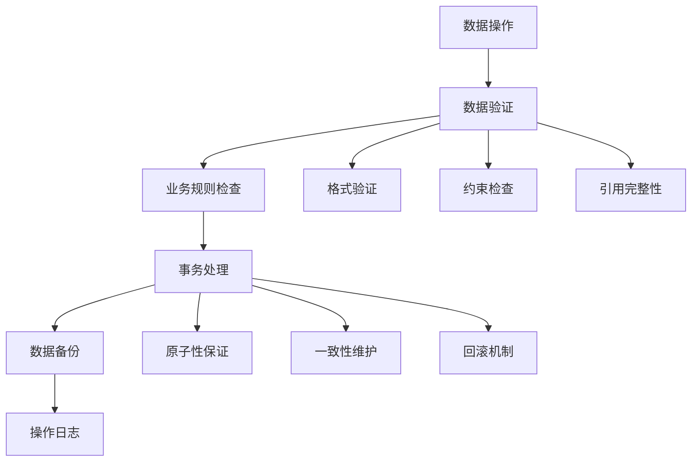

### 数据安全策略

#### 数据备份机制

| 备份类型 | 频率 | 保留期限 | 存储位置 |
|---------|------|---------|---------|
| 实时备份 | 每次修改 | 24小时 | 本地临时目录 |
| 日备份 | 每日23:00 | 30天 | 本地备份目录 |
| 周备份 | 每周日 | 12周 | 本地归档目录 |
| 月备份 | 每月最后一天 | 12个月 | 外部存储介质 |

#### 数据恢复流程

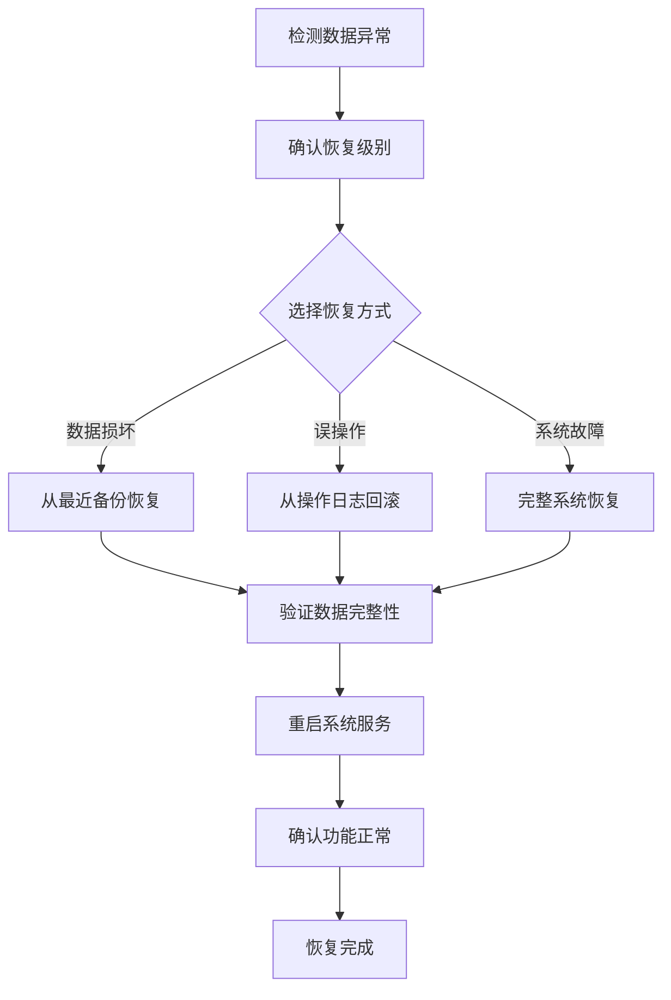

## 系统集成

### 外部系统接口

虽然当前版本为独立系统，但设计时考虑了与外部系统的集成能力。

#### 预留接口设计

| 接口类型 | 功能描述 | 数据格式 | 应用场景 |
|---------|---------|---------|---------|
| 财务系统接口 | 销售数据同步 | JSON/XML | 财务对账 |
| 供应商系统接口 | 商品信息同步 | CSV/JSON | 自动补货 |
| 支付接口 | 第三方支付 | HTTP API | 移动支付 |
| 会员卡接口 | 会员卡读取 | 二进制协议 | 实体会员卡 |
| 条码扫描接口 | 商品条码识别 | USB HID | 扫码枪支持 |

### 系统扩展性设计

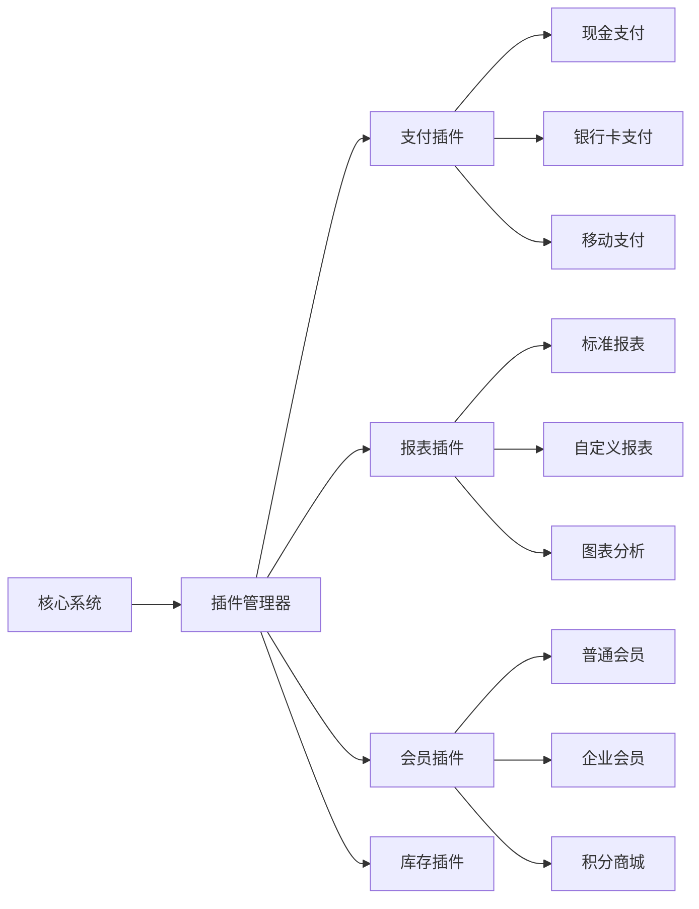

## 测试策略

### 测试覆盖范围

#### 单元测试

- 商品管理功能测试
- 库存计算逻辑测试
- 销售流程测试
- 会员积分计算测试
- 数据验证功能测试

#### 集成测试

- 模块间数据传递测试
- 业务流程端到端测试
- 数据一致性测试
- 错误处理流程测试

#### 性能测试

| 测试场景 | 性能指标 | 测试数据量 | 预期结果 |
|---------|---------|-----------|---------|
| 商品查询 | 响应时间 | 10000商品 | <100ms |
| 库存更新 | 并发处理 | 100并发 | 无数据丢失 |
| 销售处理 | 事务完整性 | 1000订单/小时 | 100%准确性 |
| 报表生成 | 内存使用 | 100000条记录 | <512MB |

### 测试数据准备

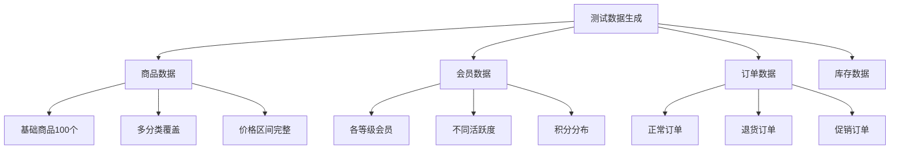

## 运行环境

### 系统要求

#### 硬件要求

| 组件 | 最低配置 | 推荐配置 | 说明 |
|------|---------|---------|------|
| CPU | 双核 1.5GHz | 四核 2.5GHz | 支持多任务处理 |
| 内存 | 2GB | 4GB | 大量数据缓存 |
| 存储 | 500MB | 2GB | 数据和备份空间 |
| 网络 | 可选 | 宽带连接 | 未来扩展需要 |

#### 软件要求

| 软件 | 版本要求 | 用途 |
|------|---------|------|
| Python | 3.7+ | 运行环境 |
| 操作系统 | Windows 10/Linux/MacOS | 跨平台支持 |

### 部署架构

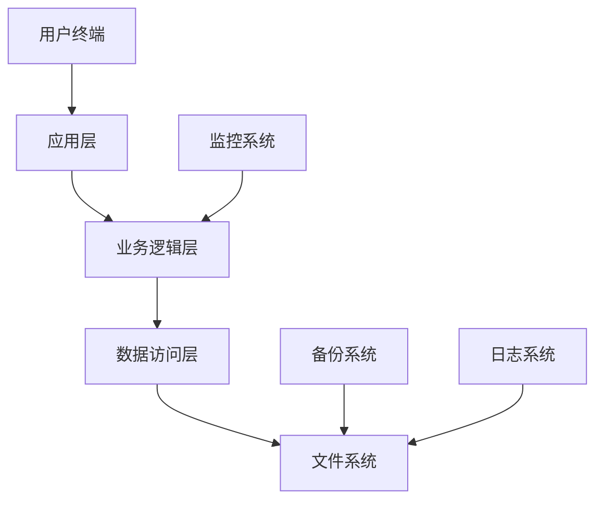

这个超市管理系统设计采用了模块化架构，参考了项目中现有系统的成熟模式，具有良好的可维护性和扩展性。系统涵盖了超市业务的核心需求，同时为未来的功能扩展预留了接口。

请查看这个设计方案，看是否符合你的预期？如果有任何需要调整或补充的地方，请告诉我。