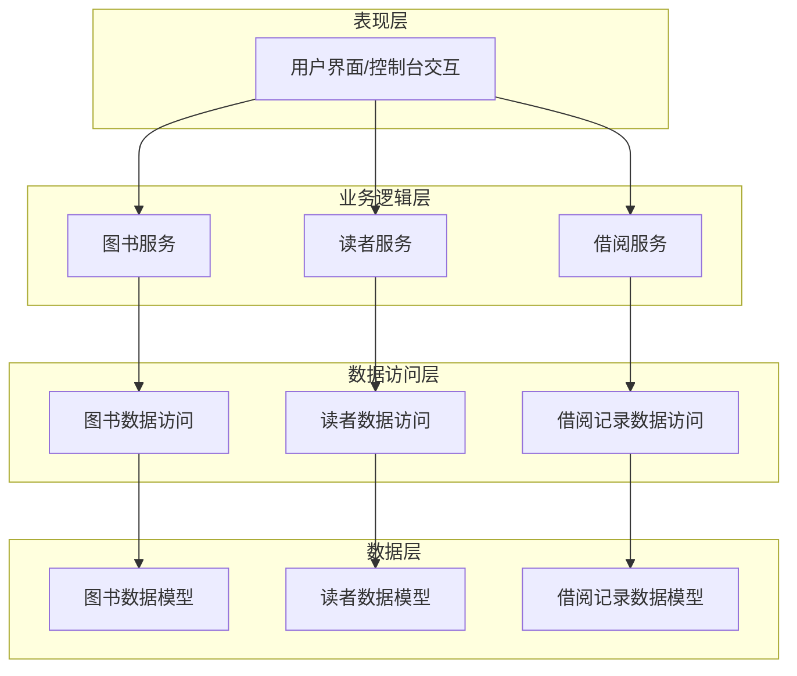
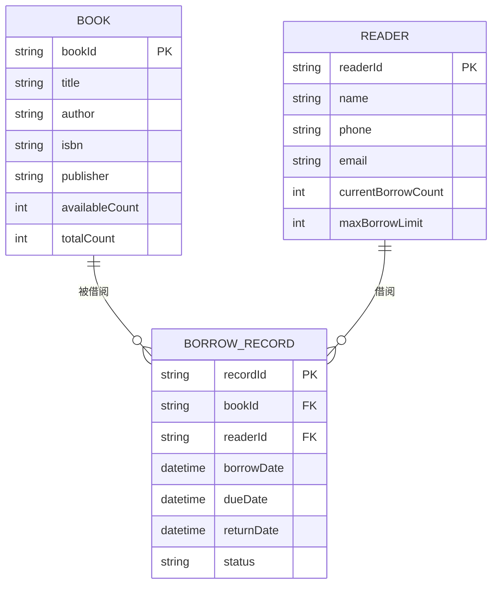
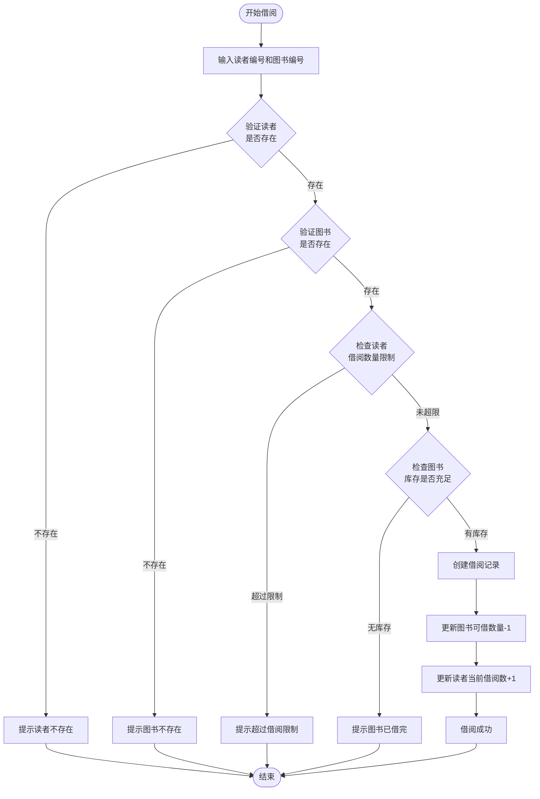
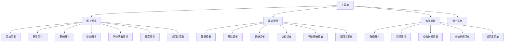
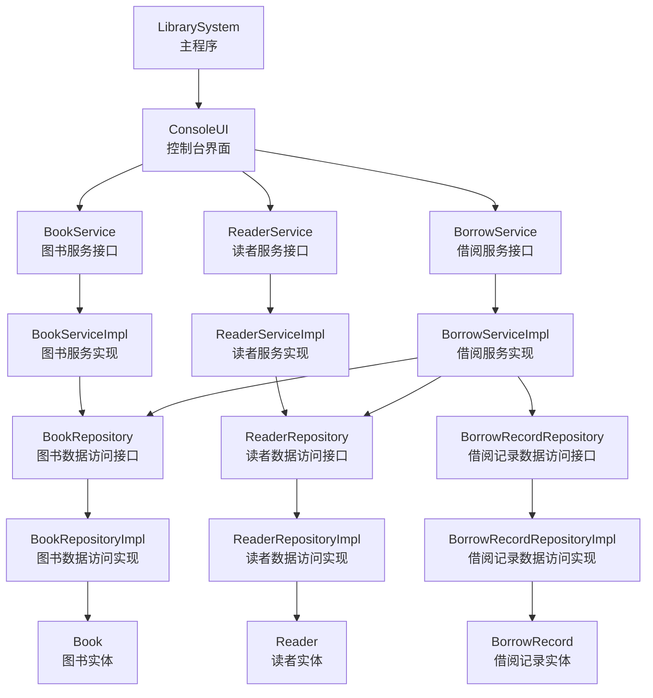
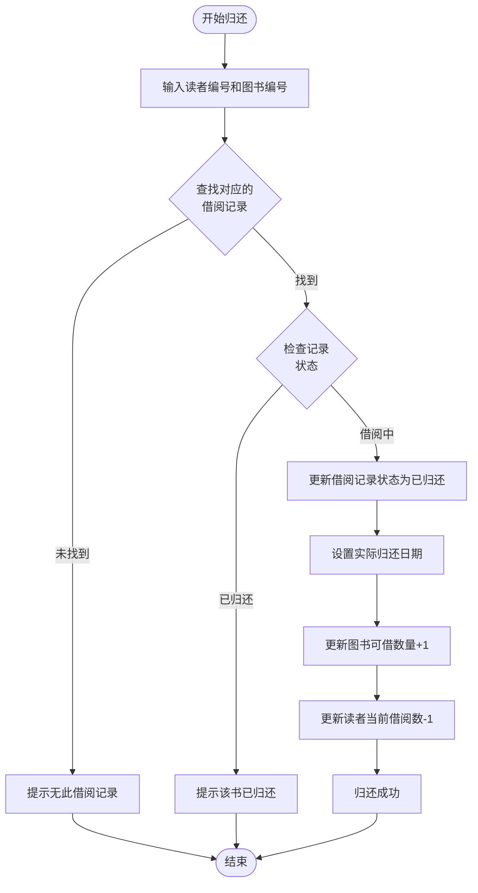

始终生效

# 图书管理系统设计文档

## 一、系统概述

### 1.1 系统目标

设计一个简单的图书管理系统，用于管理图书馆的基本业务操作，包括图书信息管理、读者信息管理以及图书借阅归还流程。系统采用Java语言实现，使用内存存储数据，适用于小型图书馆或学习演示场景。

### 1.2 核心价值

- 简化图书馆日常管理工作流程
- 提供便捷的图书借阅和归还操作
- 实时跟踪图书库存和借阅状态
- 记录读者借阅历史信息

### 1.3 系统边界

**包含功能：**
- 图书信息的增删改查
- 读者信息的增删改查
- 图书借阅操作
- 图书归还操作
- 借阅记录查询

**不包含功能：**
- 数据持久化存储（不使用数据库或文件）
- 用户权限管理
- 图书预约功能
- 罚款计算
- 多用户并发控制

## 二、系统架构

### 2.1 架构风格

采用经典的三层架构模式，确保关注点分离和代码可维护性：



### 2.2 分层职责

| 层次 | 职责描述 |
|------|----------|
| 表现层 | 负责与用户交互，接收用户输入，展示操作结果，使用控制台界面实现 |
| 业务逻辑层 | 处理业务规则和流程控制，如借阅规则验证、库存检查等 |
| 数据访问层 | 封装数据操作，提供统一的数据访问接口，使用内存集合存储 |
| 数据层 | 定义核心业务实体模型和数据结构 |

## 三、核心领域模型

### 3.1 实体模型定义

#### 图书实体（Book）

| 属性名称 | 数据类型 | 说明 | 约束 |
|---------|---------|------|------|
| 图书编号 | 字符串 | 唯一标识图书的编号 | 必填、唯一 |
| 书名 | 字符串 | 图书名称 | 必填 |
| 作者 | 字符串 | 图书作者 | 必填 |
| ISBN | 字符串 | 国际标准书号 | 可选、唯一 |
| 出版社 | 字符串 | 出版社名称 | 可选 |
| 库存数量 | 整数 | 当前可借阅数量 | 必填、≥0 |
| 总数量 | 整数 | 图书总数 | 必填、>0 |
| 借阅状态 | 枚举 | 可借阅/已借出 | 由库存数量计算得出 |

#### 读者实体（Reader）

| 属性名称 | 数据类型 | 说明 | 约束 |
|---------|---------|------|------|
| 读者编号 | 字符串 | 唯一标识读者的编号 | 必填、唯一 |
| 姓名 | 字符串 | 读者姓名 | 必填 |
| 联系电话 | 字符串 | 联系方式 | 必填 |
| 邮箱 | 字符串 | 电子邮箱 | 可选 |
| 当前借阅数 | 整数 | 当前已借图书数量 | 必填、≥0 |
| 最大借阅数 | 整数 | 允许同时借阅的最大数量 | 必填、默认5本 |

#### 借阅记录实体（BorrowRecord）

| 属性名称 | 数据类型 | 说明 | 约束 |
|---------|---------|------|------|
| 记录编号 | 字符串 | 唯一标识借阅记录 | 必填、唯一 |
| 图书编号 | 字符串 | 关联的图书 | 必填 |
| 读者编号 | 字符串 | 关联的读者 | 必填 |
| 借阅日期 | 日期时间 | 借出时间 | 必填 |
| 应还日期 | 日期时间 | 应归还时间 | 必填 |
| 实还日期 | 日期时间 | 实际归还时间 | 归还后填写 |
| 记录状态 | 枚举 | 借阅中/已归还 | 必填 |

### 3.2 实体关系



## 四、核心业务流程

### 4.1 图书借阅流程



**流程说明：**

1. 用户输入读者编号和图书编号
2. 系统验证读者信息是否存在
3. 系统验证图书信息是否存在
4. 检查读者当前借阅数是否达到上限（默认5本）
5. 检查图书库存是否充足（可借数量>0）
6. 所有验证通过后，创建借阅记录，设置借阅日期和应还日期（默认30天后）
7. 更新图书可借数量（减1）
8. 更新读者当前借阅数（加1）
9. 返回借阅成功信息

### 4.2 图书归还流程


**流程说明：**

1. 用户输入读者编号和图书编号
2. 系统查找对应的借阅记录（状态为"借阅中"）
3. 如果未找到，提示无此借阅记录
4. 如果记录已标记为"已归还"，提示重复归还
5. 更新借阅记录状态为"已归还"
6. 设置实际归还日期为当前时间
7. 更新图书可借数量（加1）
8. 更新读者当前借阅数（减1）
9. 返回归还成功信息

## 五、系统功能模块

### 5.1 图书管理模块

**功能清单：**

| 功能名称 | 功能描述 | 输入 | 输出 |
|---------|---------|------|------|
| 添加图书 | 向系统中添加新图书 | 图书详细信息 | 添加成功/失败提示 |
| 删除图书 | 从系统中删除图书 | 图书编号 | 删除成功/失败提示 |
| 更新图书 | 修改图书信息 | 图书编号、更新信息 | 更新成功/失败提示 |
| 查询图书 | 按编号查询图书详情 | 图书编号 | 图书详细信息 |
| 列出所有图书 | 展示所有图书列表 | 无 | 图书列表 |
| 搜索图书 | 按书名或作者搜索 | 关键词 | 匹配的图书列表 |

**业务规则：**

- 图书编号必须唯一，不允许重复
- 删除图书前需检查是否有未归还的借阅记录
- 库存数量不能为负数
- 总数量必须大于等于库存数量

### 5.2 读者管理模块

**功能清单：**

| 功能名称 | 功能描述 | 输入 | 输出 |
|---------|---------|------|------|
| 注册读者 | 添加新读者到系统 | 读者详细信息 | 注册成功/失败提示 |
| 删除读者 | 从系统中删除读者 | 读者编号 | 删除成功/失败提示 |
| 更新读者信息 | 修改读者信息 | 读者编号、更新信息 | 更新成功/失败提示 |
| 查询读者 | 按编号查询读者详情 | 读者编号 | 读者详细信息 |
| 列出所有读者 | 展示所有读者列表 | 无 | 读者列表 |
| 查询读者借阅历史 | 查看读者所有借阅记录 | 读者编号 | 借阅记录列表 |

**业务规则：**

- 读者编号必须唯一
- 删除读者前需检查是否有未归还的图书
- 联系电话必须提供
- 最大借阅数默认为5本，可以修改

### 5.3 借阅管理模块

**功能清单：**

| 功能名称 | 功能描述 | 输入 | 输出 |
|---------|---------|------|------|
| 借阅图书 | 办理图书借阅 | 读者编号、图书编号 | 借阅成功/失败提示 |
| 归还图书 | 办理图书归还 | 读者编号、图书编号 | 归还成功/失败提示 |
| 查询借阅记录 | 查看指定借阅记录详情 | 记录编号 | 借阅记录详情 |
| 查询图书借阅状态 | 查看某本书的所有借阅记录 | 图书编号 | 借阅记录列表 |
| 查询当前借阅清单 | 查看所有未归还的借阅 | 无 | 未归还借阅列表 |

**业务规则：**

- 同一读者不能同时借阅同一本书的多个副本
- 读者当前借阅数不能超过最大借阅限制
- 图书库存为0时不能借出
- 应还日期默认为借阅日期后30天
- 归还时必须存在对应的未归还借阅记录

## 六、数据管理策略

### 6.1 数据存储方案

由于系统采用内存存储，数据将保存在以下结构中：

| 数据类型 | 存储结构 | 键类型 | 值类型 | 说明 |
|---------|---------|--------|--------|------|
| 图书数据 | HashMap | String（图书编号） | Book对象 | 支持快速按编号查询 |
| 读者数据 | HashMap | String（读者编号） | Reader对象 | 支持快速按编号查询 |
| 借阅记录 | HashMap | String（记录编号） | BorrowRecord对象 | 支持快速按记录编号查询 |
| 借阅记录索引 | HashMap | String（读者编号） | List<记录编号> | 支持按读者查询借阅历史 |

**数据访问特性：**

- 所有数据在程序运行时保存在内存中
- 程序关闭后数据丢失
- 查询操作时间复杂度为O(1)
- 不需要考虑数据持久化和事务管理

### 6.2 数据验证规则

**输入验证：**

| 验证项 | 验证规则 | 错误提示 |
|-------|---------|---------|
| 图书编号 | 非空、唯一性 | "图书编号不能为空"、"图书编号已存在" |
| 书名 | 非空、长度限制（1-100字符） | "书名不能为空"、"书名过长" |
| ISBN | 可选、格式验证 | "ISBN格式不正确" |
| 库存数量 | 非负整数、≤总数量 | "库存数量不能为负"、"库存超过总数" |
| 读者编号 | 非空、唯一性 | "读者编号不能为空"、"读者编号已存在" |
| 联系电话 | 非空、格式验证 | "联系电话不能为空"、"电话格式不正确" |

## 七、用户交互设计

### 7.1 控制台菜单结构



### 7.2 交互流程示例

**借阅图书交互流程：**

```
系统：请选择操作（1-借阅图书）
用户：1
系统：请输入读者编号：
用户：R001
系统：请输入图书编号：
用户：B001
系统：正在处理借阅请求...
系统：借阅成功！
      读者：张三（R001）
      图书：Java编程思想（B001）
      借阅日期：2024-01-15
      应还日期：2024-02-14
系统：按任意键返回菜单...
```

## 八、异常处理策略

### 8.1 异常分类

| 异常类型 | 触发场景 | 处理方式 |
|---------|---------|---------|
| 数据不存在异常 | 查询的图书/读者不存在 | 提示用户数据不存在，返回上级菜单 |
| 数据重复异常 | 添加已存在的编号 | 提示编号已存在，要求重新输入 |
| 业务规则异常 | 违反借阅规则（超限、无库存等） | 提示具体原因，拒绝操作 |
| 输入格式异常 | 用户输入格式不正确 | 提示正确格式，要求重新输入 |
| 系统运行异常 | 未预期的运行时错误 | 记录错误信息，提示用户稍后重试 |

### 8.2 错误提示规范

所有错误提示应遵循以下原则：

- 清晰明确地说明错误原因
- 提供可操作的解决建议
- 使用友好的语言表达
- 避免暴露系统内部技术细节

**示例：**

- ✓ "该读者已达到最大借阅数量限制（5本），请先归还部分图书后再借阅"
- ✗ "BorrowLimitExceededException: current=5, max=5"

## 九、系统扩展性考虑

### 9.1 预留扩展点

虽然当前系统采用简单设计，但在架构上预留了以下扩展可能：

| 扩展方向 | 当前设计 | 扩展建议 |
|---------|---------|---------|
| 数据持久化 | 内存存储 | 数据访问层使用接口定义，可替换为文件或数据库实现 |
| 用户权限 | 无权限控制 | 可增加用户角色和权限验证模块 |
| 罚款功能 | 不支持 | 可在借阅记录中增加罚款计算逻辑 |
| 图书预约 | 不支持 | 可增加预约队列管理模块 |
| 多副本管理 | 使用数量字段 | 可细化为独立的图书副本实体 |

### 9.2 接口设计原则

各层之间通过接口进行交互，便于未来替换实现：

- 数据访问层定义Repository接口，当前使用内存实现，未来可替换为数据库实现
- 业务逻辑层定义Service接口，解耦业务逻辑和数据访问
- 表现层调用Service接口，不直接依赖具体实现类

## 十、系统组件清单

### 10.1 核心组件列表

| 组件名称 | 组件类型 | 职责描述 |
|---------|---------|---------|
| Book | 实体类 | 表示图书领域对象 |
| Reader | 实体类 | 表示读者领域对象 |
| BorrowRecord | 实体类 | 表示借阅记录领域对象 |
| BookRepository | 数据访问接口 | 定义图书数据访问操作 |
| ReaderRepository | 数据访问接口 | 定义读者数据访问操作 |
| BorrowRecordRepository | 数据访问接口 | 定义借阅记录数据访问操作 |
| BookRepositoryImpl | 数据访问实现 | 实现图书数据的内存存储 |
| ReaderRepositoryImpl | 数据访问实现 | 实现读者数据的内存存储 |
| BorrowRecordRepositoryImpl | 数据访问实现 | 实现借阅记录的内存存储 |
| BookService | 业务服务接口 | 定义图书管理业务操作 |
| ReaderService | 业务服务接口 | 定义读者管理业务操作 |
| BorrowService | 业务服务接口 | 定义借阅管理业务操作 |
| BookServiceImpl | 业务服务实现 | 实现图书管理业务逻辑 |
| ReaderServiceImpl | 业务服务实现 | 实现读者管理业务逻辑 |
| BorrowServiceImpl | 业务服务实现 | 实现借阅管理业务逻辑 |
| LibrarySystem | 主程序类 | 程序入口，初始化系统 |
| ConsoleUI | 控制台界面 | 处理用户交互和菜单显示 |

### 10.2 组件依赖关系



## 十一、实施建议

### 11.1 开发优先级

建议按照以下顺序实施开发：

**第一阶段：基础数据层**
1. 创建实体类（Book、Reader、BorrowRecord）
2. 实现数据访问层（Repository接口和实现类）
3. 编写单元测试验证数据操作

**第二阶段：业务逻辑层**
1. 实现图书管理服务（BookService）
2. 实现读者管理服务（ReaderService）
3. 实现借阅管理服务（BorrowService）
4. 编写业务逻辑单元测试

**第三阶段：用户界面层**
1. 实现控制台菜单系统（ConsoleUI）
2. 实现各功能的用户交互流程
3. 集成所有模块
4. 进行端到端测试

**第四阶段：完善优化**
1. 添加异常处理和错误提示
2. 优化用户体验
3. 添加初始化数据用于演示
4. 编写使用说明文档

### 11.2 测试策略

| 测试类型 | 测试内容 | 测试方法 |
|---------|---------|---------|
| 单元测试 | 每个类的独立功能 | 使用JUnit框架编写测试用例 |
| 集成测试 | 各层之间的协作 | 测试服务层调用数据访问层的完整流程 |
| 功能测试 | 业务场景验证 | 模拟实际借阅归还流程 |
| 边界测试 | 异常情况处理 | 测试各种边界条件和异常输入 |

### 11.3 质量标准

- 所有公共方法都应包含适当的注释说明
- 关键业务逻辑应有详细的文档说明
- 异常情况都应有明确的错误提示
- 用户界面应清晰易懂，操作流畅
- 系统应能正确处理各种非法输入
始终生效

# 图书管理系统设计文档

## 一、系统概述

### 1.1 系统目标

设计一个简单的图书管理系统，用于管理图书馆的基本业务操作，包括图书信息管理、读者信息管理以及图书借阅归还流程。系统采用Java语言实现，使用内存存储数据，适用于小型图书馆或学习演示场景。

### 1.2 核心价值

- 简化图书馆日常管理工作流程
- 提供便捷的图书借阅和归还操作
- 实时跟踪图书库存和借阅状态
- 记录读者借阅历史信息

### 1.3 系统边界

**包含功能：**
- 图书信息的增删改查
- 读者信息的增删改查
- 图书借阅操作
- 图书归还操作
- 借阅记录查询

**不包含功能：**
- 数据持久化存储（不使用数据库或文件）
- 用户权限管理
- 图书预约功能
- 罚款计算
- 多用户并发控制

## 二、系统架构

### 2.1 架构风格

采用经典的三层架构模式，确保关注点分离和代码可维护性：


### 2.2 分层职责

| 层次 | 职责描述 |
|------|----------|
| 表现层 | 负责与用户交互，接收用户输入，展示操作结果，使用控制台界面实现 |
| 业务逻辑层 | 处理业务规则和流程控制，如借阅规则验证、库存检查等 |
| 数据访问层 | 封装数据操作，提供统一的数据访问接口，使用内存集合存储 |
| 数据层 | 定义核心业务实体模型和数据结构 |

## 三、核心领域模型

### 3.1 实体模型定义

#### 图书实体（Book）

| 属性名称 | 数据类型 | 说明 | 约束 |
|---------|---------|------|------|
| 图书编号 | 字符串 | 唯一标识图书的编号 | 必填、唯一 |
| 书名 | 字符串 | 图书名称 | 必填 |
| 作者 | 字符串 | 图书作者 | 必填 |
| ISBN | 字符串 | 国际标准书号 | 可选、唯一 |
| 出版社 | 字符串 | 出版社名称 | 可选 |
| 库存数量 | 整数 | 当前可借阅数量 | 必填、≥0 |
| 总数量 | 整数 | 图书总数 | 必填、>0 |
| 借阅状态 | 枚举 | 可借阅/已借出 | 由库存数量计算得出 |

#### 读者实体（Reader）

| 属性名称 | 数据类型 | 说明 | 约束 |
|---------|---------|------|------|
| 读者编号 | 字符串 | 唯一标识读者的编号 | 必填、唯一 |
| 姓名 | 字符串 | 读者姓名 | 必填 |
| 联系电话 | 字符串 | 联系方式 | 必填 |
| 邮箱 | 字符串 | 电子邮箱 | 可选 |
| 当前借阅数 | 整数 | 当前已借图书数量 | 必填、≥0 |
| 最大借阅数 | 整数 | 允许同时借阅的最大数量 | 必填、默认5本 |

#### 借阅记录实体（BorrowRecord）

| 属性名称 | 数据类型 | 说明 | 约束 |
|---------|---------|------|------|
| 记录编号 | 字符串 | 唯一标识借阅记录 | 必填、唯一 |
| 图书编号 | 字符串 | 关联的图书 | 必填 |
| 读者编号 | 字符串 | 关联的读者 | 必填 |
| 借阅日期 | 日期时间 | 借出时间 | 必填 |
| 应还日期 | 日期时间 | 应归还时间 | 必填 |
| 实还日期 | 日期时间 | 实际归还时间 | 归还后填写 |
| 记录状态 | 枚举 | 借阅中/已归还 | 必填 |

### 3.2 实体关系


## 四、核心业务流程

### 4.1 图书借阅流程


**流程说明：**

1. 用户输入读者编号和图书编号
2. 系统验证读者信息是否存在
3. 系统验证图书信息是否存在
4. 检查读者当前借阅数是否达到上限（默认5本）
5. 检查图书库存是否充足（可借数量>0）
6. 所有验证通过后，创建借阅记录，设置借阅日期和应还日期（默认30天后）
7. 更新图书可借数量（减1）
8. 更新读者当前借阅数（加1）
9. 返回借阅成功信息

### 4.2 图书归还流程


**流程说明：**

1. 用户输入读者编号和图书编号
2. 系统查找对应的借阅记录（状态为"借阅中"）
3. 如果未找到，提示无此借阅记录
4. 如果记录已标记为"已归还"，提示重复归还
5. 更新借阅记录状态为"已归还"
6. 设置实际归还日期为当前时间
7. 更新图书可借数量（加1）
8. 更新读者当前借阅数（减1）
9. 返回归还成功信息

## 五、系统功能模块

### 5.1 图书管理模块

**功能清单：**

| 功能名称 | 功能描述 | 输入 | 输出 |
|---------|---------|------|------|
| 添加图书 | 向系统中添加新图书 | 图书详细信息 | 添加成功/失败提示 |
| 删除图书 | 从系统中删除图书 | 图书编号 | 删除成功/失败提示 |
| 更新图书 | 修改图书信息 | 图书编号、更新信息 | 更新成功/失败提示 |
| 查询图书 | 按编号查询图书详情 | 图书编号 | 图书详细信息 |
| 列出所有图书 | 展示所有图书列表 | 无 | 图书列表 |
| 搜索图书 | 按书名或作者搜索 | 关键词 | 匹配的图书列表 |

**业务规则：**

- 图书编号必须唯一，不允许重复
- 删除图书前需检查是否有未归还的借阅记录
- 库存数量不能为负数
- 总数量必须大于等于库存数量

### 5.2 读者管理模块

**功能清单：**

| 功能名称 | 功能描述 | 输入 | 输出 |
|---------|---------|------|------|
| 注册读者 | 添加新读者到系统 | 读者详细信息 | 注册成功/失败提示 |
| 删除读者 | 从系统中删除读者 | 读者编号 | 删除成功/失败提示 |
| 更新读者信息 | 修改读者信息 | 读者编号、更新信息 | 更新成功/失败提示 |
| 查询读者 | 按编号查询读者详情 | 读者编号 | 读者详细信息 |
| 列出所有读者 | 展示所有读者列表 | 无 | 读者列表 |
| 查询读者借阅历史 | 查看读者所有借阅记录 | 读者编号 | 借阅记录列表 |

**业务规则：**

- 读者编号必须唯一
- 删除读者前需检查是否有未归还的图书
- 联系电话必须提供
- 最大借阅数默认为5本，可以修改

### 5.3 借阅管理模块

**功能清单：**

| 功能名称 | 功能描述 | 输入 | 输出 |
|---------|---------|------|------|
| 借阅图书 | 办理图书借阅 | 读者编号、图书编号 | 借阅成功/失败提示 |
| 归还图书 | 办理图书归还 | 读者编号、图书编号 | 归还成功/失败提示 |
| 查询借阅记录 | 查看指定借阅记录详情 | 记录编号 | 借阅记录详情 |
| 查询图书借阅状态 | 查看某本书的所有借阅记录 | 图书编号 | 借阅记录列表 |
| 查询当前借阅清单 | 查看所有未归还的借阅 | 无 | 未归还借阅列表 |

**业务规则：**

- 同一读者不能同时借阅同一本书的多个副本
- 读者当前借阅数不能超过最大借阅限制
- 图书库存为0时不能借出
- 应还日期默认为借阅日期后30天
- 归还时必须存在对应的未归还借阅记录

## 六、数据管理策略

### 6.1 数据存储方案

由于系统采用内存存储，数据将保存在以下结构中：

| 数据类型 | 存储结构 | 键类型 | 值类型 | 说明 |
|---------|---------|--------|--------|------|
| 图书数据 | HashMap | String（图书编号） | Book对象 | 支持快速按编号查询 |
| 读者数据 | HashMap | String（读者编号） | Reader对象 | 支持快速按编号查询 |
| 借阅记录 | HashMap | String（记录编号） | BorrowRecord对象 | 支持快速按记录编号查询 |
| 借阅记录索引 | HashMap | String（读者编号） | List<记录编号> | 支持按读者查询借阅历史 |

**数据访问特性：**

- 所有数据在程序运行时保存在内存中
- 程序关闭后数据丢失
- 查询操作时间复杂度为O(1)
- 不需要考虑数据持久化和事务管理

### 6.2 数据验证规则

**输入验证：**

| 验证项 | 验证规则 | 错误提示 |
|-------|---------|---------|
| 图书编号 | 非空、唯一性 | "图书编号不能为空"、"图书编号已存在" |
| 书名 | 非空、长度限制（1-100字符） | "书名不能为空"、"书名过长" |
| ISBN | 可选、格式验证 | "ISBN格式不正确" |
| 库存数量 | 非负整数、≤总数量 | "库存数量不能为负"、"库存超过总数" |
| 读者编号 | 非空、唯一性 | "读者编号不能为空"、"读者编号已存在" |
| 联系电话 | 非空、格式验证 | "联系电话不能为空"、"电话格式不正确" |

## 七、用户交互设计

### 7.1 控制台菜单结构


### 7.2 交互流程示例

**借阅图书交互流程：**

```
系统：请选择操作（1-借阅图书）
用户：1
系统：请输入读者编号：
用户：R001
系统：请输入图书编号：
用户：B001
系统：正在处理借阅请求...
系统：借阅成功！
      读者：张三（R001）
      图书：Java编程思想（B001）
      借阅日期：2024-01-15
      应还日期：2024-02-14
系统：按任意键返回菜单...
```

## 八、异常处理策略

### 8.1 异常分类

| 异常类型 | 触发场景 | 处理方式 |
|---------|---------|---------|
| 数据不存在异常 | 查询的图书/读者不存在 | 提示用户数据不存在，返回上级菜单 |
| 数据重复异常 | 添加已存在的编号 | 提示编号已存在，要求重新输入 |
| 业务规则异常 | 违反借阅规则（超限、无库存等） | 提示具体原因，拒绝操作 |
| 输入格式异常 | 用户输入格式不正确 | 提示正确格式，要求重新输入 |
| 系统运行异常 | 未预期的运行时错误 | 记录错误信息，提示用户稍后重试 |

### 8.2 错误提示规范

所有错误提示应遵循以下原则：

- 清晰明确地说明错误原因
- 提供可操作的解决建议
- 使用友好的语言表达
- 避免暴露系统内部技术细节

**示例：**

- ✓ "该读者已达到最大借阅数量限制（5本），请先归还部分图书后再借阅"
- ✗ "BorrowLimitExceededException: current=5, max=5"

## 九、系统扩展性考虑

### 9.1 预留扩展点

虽然当前系统采用简单设计，但在架构上预留了以下扩展可能：

| 扩展方向 | 当前设计 | 扩展建议 |
|---------|---------|---------|
| 数据持久化 | 内存存储 | 数据访问层使用接口定义，可替换为文件或数据库实现 |
| 用户权限 | 无权限控制 | 可增加用户角色和权限验证模块 |
| 罚款功能 | 不支持 | 可在借阅记录中增加罚款计算逻辑 |
| 图书预约 | 不支持 | 可增加预约队列管理模块 |
| 多副本管理 | 使用数量字段 | 可细化为独立的图书副本实体 |

### 9.2 接口设计原则

各层之间通过接口进行交互，便于未来替换实现：

- 数据访问层定义Repository接口，当前使用内存实现，未来可替换为数据库实现
- 业务逻辑层定义Service接口，解耦业务逻辑和数据访问
- 表现层调用Service接口，不直接依赖具体实现类

## 十、系统组件清单

### 10.1 核心组件列表

| 组件名称 | 组件类型 | 职责描述 |
|---------|---------|---------|
| Book | 实体类 | 表示图书领域对象 |
| Reader | 实体类 | 表示读者领域对象 |
| BorrowRecord | 实体类 | 表示借阅记录领域对象 |
| BookRepository | 数据访问接口 | 定义图书数据访问操作 |
| ReaderRepository | 数据访问接口 | 定义读者数据访问操作 |
| BorrowRecordRepository | 数据访问接口 | 定义借阅记录数据访问操作 |
| BookRepositoryImpl | 数据访问实现 | 实现图书数据的内存存储 |
| ReaderRepositoryImpl | 数据访问实现 | 实现读者数据的内存存储 |
| BorrowRecordRepositoryImpl | 数据访问实现 | 实现借阅记录的内存存储 |
| BookService | 业务服务接口 | 定义图书管理业务操作 |
| ReaderService | 业务服务接口 | 定义读者管理业务操作 |
| BorrowService | 业务服务接口 | 定义借阅管理业务操作 |
| BookServiceImpl | 业务服务实现 | 实现图书管理业务逻辑 |
| ReaderServiceImpl | 业务服务实现 | 实现读者管理业务逻辑 |
| BorrowServiceImpl | 业务服务实现 | 实现借阅管理业务逻辑 |
| LibrarySystem | 主程序类 | 程序入口，初始化系统 |
| ConsoleUI | 控制台界面 | 处理用户交互和菜单显示 |

### 10.2 组件依赖关系


## 十一、实施建议

### 11.1 开发优先级

建议按照以下顺序实施开发：

**第一阶段：基础数据层**
1. 创建实体类（Book、Reader、BorrowRecord）
2. 实现数据访问层（Repository接口和实现类）
3. 编写单元测试验证数据操作

**第二阶段：业务逻辑层**
1. 实现图书管理服务（BookService）
2. 实现读者管理服务（ReaderService）
3. 实现借阅管理服务（BorrowService）
4. 编写业务逻辑单元测试

**第三阶段：用户界面层**
1. 实现控制台菜单系统（ConsoleUI）
2. 实现各功能的用户交互流程
3. 集成所有模块
4. 进行端到端测试

**第四阶段：完善优化**
1. 添加异常处理和错误提示
2. 优化用户体验
3. 添加初始化数据用于演示
4. 编写使用说明文档

### 11.2 测试策略

| 测试类型 | 测试内容 | 测试方法 |
|---------|---------|---------|
| 单元测试 | 每个类的独立功能 | 使用JUnit框架编写测试用例 |
| 集成测试 | 各层之间的协作 | 测试服务层调用数据访问层的完整流程 |
| 功能测试 | 业务场景验证 | 模拟实际借阅归还流程 |
| 边界测试 | 异常情况处理 | 测试各种边界条件和异常输入 |

### 11.3 质量标准

- 所有公共方法都应包含适当的注释说明
- 关键业务逻辑应有详细的文档说明
- 异常情况都应有明确的错误提示
- 用户界面应清晰易懂，操作流畅
- 系统应能正确处理各种非法输入
始终生效

# 图书管理系统设计文档

## 一、系统概述

### 1.1 系统目标

设计一个简单的图书管理系统，用于管理图书馆的基本业务操作，包括图书信息管理、读者信息管理以及图书借阅归还流程。系统采用Java语言实现，使用内存存储数据，适用于小型图书馆或学习演示场景。

### 1.2 核心价值

- 简化图书馆日常管理工作流程
- 提供便捷的图书借阅和归还操作
- 实时跟踪图书库存和借阅状态
- 记录读者借阅历史信息

### 1.3 系统边界

**包含功能：**
- 图书信息的增删改查
- 读者信息的增删改查
- 图书借阅操作
- 图书归还操作
- 借阅记录查询

**不包含功能：**
- 数据持久化存储（不使用数据库或文件）
- 用户权限管理
- 图书预约功能
- 罚款计算
- 多用户并发控制

## 二、系统架构

### 2.1 架构风格

采用经典的三层架构模式，确保关注点分离和代码可维护性：


### 2.2 分层职责

| 层次 | 职责描述 |
|------|----------|
| 表现层 | 负责与用户交互，接收用户输入，展示操作结果，使用控制台界面实现 |
| 业务逻辑层 | 处理业务规则和流程控制，如借阅规则验证、库存检查等 |
| 数据访问层 | 封装数据操作，提供统一的数据访问接口，使用内存集合存储 |
| 数据层 | 定义核心业务实体模型和数据结构 |

## 三、核心领域模型

### 3.1 实体模型定义

#### 图书实体（Book）

| 属性名称 | 数据类型 | 说明 | 约束 |
|---------|---------|------|------|
| 图书编号 | 字符串 | 唯一标识图书的编号 | 必填、唯一 |
| 书名 | 字符串 | 图书名称 | 必填 |
| 作者 | 字符串 | 图书作者 | 必填 |
| ISBN | 字符串 | 国际标准书号 | 可选、唯一 |
| 出版社 | 字符串 | 出版社名称 | 可选 |
| 库存数量 | 整数 | 当前可借阅数量 | 必填、≥0 |
| 总数量 | 整数 | 图书总数 | 必填、>0 |
| 借阅状态 | 枚举 | 可借阅/已借出 | 由库存数量计算得出 |

#### 读者实体（Reader）

| 属性名称 | 数据类型 | 说明 | 约束 |
|---------|---------|------|------|
| 读者编号 | 字符串 | 唯一标识读者的编号 | 必填、唯一 |
| 姓名 | 字符串 | 读者姓名 | 必填 |
| 联系电话 | 字符串 | 联系方式 | 必填 |
| 邮箱 | 字符串 | 电子邮箱 | 可选 |
| 当前借阅数 | 整数 | 当前已借图书数量 | 必填、≥0 |
| 最大借阅数 | 整数 | 允许同时借阅的最大数量 | 必填、默认5本 |

#### 借阅记录实体（BorrowRecord）

| 属性名称 | 数据类型 | 说明 | 约束 |
|---------|---------|------|------|
| 记录编号 | 字符串 | 唯一标识借阅记录 | 必填、唯一 |
| 图书编号 | 字符串 | 关联的图书 | 必填 |
| 读者编号 | 字符串 | 关联的读者 | 必填 |
| 借阅日期 | 日期时间 | 借出时间 | 必填 |
| 应还日期 | 日期时间 | 应归还时间 | 必填 |
| 实还日期 | 日期时间 | 实际归还时间 | 归还后填写 |
| 记录状态 | 枚举 | 借阅中/已归还 | 必填 |

### 3.2 实体关系


## 四、核心业务流程

### 4.1 图书借阅流程


**流程说明：**

1. 用户输入读者编号和图书编号
2. 系统验证读者信息是否存在
3. 系统验证图书信息是否存在
4. 检查读者当前借阅数是否达到上限（默认5本）
5. 检查图书库存是否充足（可借数量>0）
6. 所有验证通过后，创建借阅记录，设置借阅日期和应还日期（默认30天后）
7. 更新图书可借数量（减1）
8. 更新读者当前借阅数（加1）
9. 返回借阅成功信息

### 4.2 图书归还流程



**流程说明：**

1. 用户输入读者编号和图书编号
2. 系统查找对应的借阅记录（状态为"借阅中"）
3. 如果未找到，提示无此借阅记录
4. 如果记录已标记为"已归还"，提示重复归还
5. 更新借阅记录状态为"已归还"
6. 设置实际归还日期为当前时间
7. 更新图书可借数量（加1）
8. 更新读者当前借阅数（减1）
9. 返回归还成功信息

## 五、系统功能模块

### 5.1 图书管理模块

**功能清单：**

| 功能名称 | 功能描述 | 输入 | 输出 |
|---------|---------|------|------|
| 添加图书 | 向系统中添加新图书 | 图书详细信息 | 添加成功/失败提示 |
| 删除图书 | 从系统中删除图书 | 图书编号 | 删除成功/失败提示 |
| 更新图书 | 修改图书信息 | 图书编号、更新信息 | 更新成功/失败提示 |
| 查询图书 | 按编号查询图书详情 | 图书编号 | 图书详细信息 |
| 列出所有图书 | 展示所有图书列表 | 无 | 图书列表 |
| 搜索图书 | 按书名或作者搜索 | 关键词 | 匹配的图书列表 |

**业务规则：**

- 图书编号必须唯一，不允许重复
- 删除图书前需检查是否有未归还的借阅记录
- 库存数量不能为负数
- 总数量必须大于等于库存数量

### 5.2 读者管理模块

**功能清单：**

| 功能名称 | 功能描述 | 输入 | 输出 |
|---------|---------|------|------|
| 注册读者 | 添加新读者到系统 | 读者详细信息 | 注册成功/失败提示 |
| 删除读者 | 从系统中删除读者 | 读者编号 | 删除成功/失败提示 |
| 更新读者信息 | 修改读者信息 | 读者编号、更新信息 | 更新成功/失败提示 |
| 查询读者 | 按编号查询读者详情 | 读者编号 | 读者详细信息 |
| 列出所有读者 | 展示所有读者列表 | 无 | 读者列表 |
| 查询读者借阅历史 | 查看读者所有借阅记录 | 读者编号 | 借阅记录列表 |

**业务规则：**

- 读者编号必须唯一
- 删除读者前需检查是否有未归还的图书
- 联系电话必须提供
- 最大借阅数默认为5本，可以修改

### 5.3 借阅管理模块

**功能清单：**

| 功能名称 | 功能描述 | 输入 | 输出 |
|---------|---------|------|------|
| 借阅图书 | 办理图书借阅 | 读者编号、图书编号 | 借阅成功/失败提示 |
| 归还图书 | 办理图书归还 | 读者编号、图书编号 | 归还成功/失败提示 |
| 查询借阅记录 | 查看指定借阅记录详情 | 记录编号 | 借阅记录详情 |
| 查询图书借阅状态 | 查看某本书的所有借阅记录 | 图书编号 | 借阅记录列表 |
| 查询当前借阅清单 | 查看所有未归还的借阅 | 无 | 未归还借阅列表 |

**业务规则：**

- 同一读者不能同时借阅同一本书的多个副本
- 读者当前借阅数不能超过最大借阅限制
- 图书库存为0时不能借出
- 应还日期默认为借阅日期后30天
- 归还时必须存在对应的未归还借阅记录

## 六、数据管理策略

### 6.1 数据存储方案

由于系统采用内存存储，数据将保存在以下结构中：

| 数据类型 | 存储结构 | 键类型 | 值类型 | 说明 |
|---------|---------|--------|--------|------|
| 图书数据 | HashMap | String（图书编号） | Book对象 | 支持快速按编号查询 |
| 读者数据 | HashMap | String（读者编号） | Reader对象 | 支持快速按编号查询 |
| 借阅记录 | HashMap | String（记录编号） | BorrowRecord对象 | 支持快速按记录编号查询 |
| 借阅记录索引 | HashMap | String（读者编号） | List<记录编号> | 支持按读者查询借阅历史 |

**数据访问特性：**

- 所有数据在程序运行时保存在内存中
- 程序关闭后数据丢失
- 查询操作时间复杂度为O(1)
- 不需要考虑数据持久化和事务管理

### 6.2 数据验证规则

**输入验证：**

| 验证项 | 验证规则 | 错误提示 |
|-------|---------|---------|
| 图书编号 | 非空、唯一性 | "图书编号不能为空"、"图书编号已存在" |
| 书名 | 非空、长度限制（1-100字符） | "书名不能为空"、"书名过长" |
| ISBN | 可选、格式验证 | "ISBN格式不正确" |
| 库存数量 | 非负整数、≤总数量 | "库存数量不能为负"、"库存超过总数" |
| 读者编号 | 非空、唯一性 | "读者编号不能为空"、"读者编号已存在" |
| 联系电话 | 非空、格式验证 | "联系电话不能为空"、"电话格式不正确" |

## 七、用户交互设计

### 7.1 控制台菜单结构


### 7.2 交互流程示例

**借阅图书交互流程：**

```
系统：请选择操作（1-借阅图书）
用户：1
系统：请输入读者编号：
用户：R001
系统：请输入图书编号：
用户：B001
系统：正在处理借阅请求...
系统：借阅成功！
      读者：张三（R001）
      图书：Java编程思想（B001）
      借阅日期：2024-01-15
      应还日期：2024-02-14
系统：按任意键返回菜单...
```

## 八、异常处理策略

### 8.1 异常分类

| 异常类型 | 触发场景 | 处理方式 |
|---------|---------|---------|
| 数据不存在异常 | 查询的图书/读者不存在 | 提示用户数据不存在，返回上级菜单 |
| 数据重复异常 | 添加已存在的编号 | 提示编号已存在，要求重新输入 |
| 业务规则异常 | 违反借阅规则（超限、无库存等） | 提示具体原因，拒绝操作 |
| 输入格式异常 | 用户输入格式不正确 | 提示正确格式，要求重新输入 |
| 系统运行异常 | 未预期的运行时错误 | 记录错误信息，提示用户稍后重试 |

### 8.2 错误提示规范

所有错误提示应遵循以下原则：

- 清晰明确地说明错误原因
- 提供可操作的解决建议
- 使用友好的语言表达
- 避免暴露系统内部技术细节

**示例：**

- ✓ "该读者已达到最大借阅数量限制（5本），请先归还部分图书后再借阅"
- ✗ "BorrowLimitExceededException: current=5, max=5"

## 九、系统扩展性考虑

### 9.1 预留扩展点

虽然当前系统采用简单设计，但在架构上预留了以下扩展可能：

| 扩展方向 | 当前设计 | 扩展建议 |
|---------|---------|---------|
| 数据持久化 | 内存存储 | 数据访问层使用接口定义，可替换为文件或数据库实现 |
| 用户权限 | 无权限控制 | 可增加用户角色和权限验证模块 |
| 罚款功能 | 不支持 | 可在借阅记录中增加罚款计算逻辑 |
| 图书预约 | 不支持 | 可增加预约队列管理模块 |
| 多副本管理 | 使用数量字段 | 可细化为独立的图书副本实体 |

### 9.2 接口设计原则

各层之间通过接口进行交互，便于未来替换实现：

- 数据访问层定义Repository接口，当前使用内存实现，未来可替换为数据库实现
- 业务逻辑层定义Service接口，解耦业务逻辑和数据访问
- 表现层调用Service接口，不直接依赖具体实现类

## 十、系统组件清单

### 10.1 核心组件列表

| 组件名称 | 组件类型 | 职责描述 |
|---------|---------|---------|
| Book | 实体类 | 表示图书领域对象 |
| Reader | 实体类 | 表示读者领域对象 |
| BorrowRecord | 实体类 | 表示借阅记录领域对象 |
| BookRepository | 数据访问接口 | 定义图书数据访问操作 |
| ReaderRepository | 数据访问接口 | 定义读者数据访问操作 |
| BorrowRecordRepository | 数据访问接口 | 定义借阅记录数据访问操作 |
| BookRepositoryImpl | 数据访问实现 | 实现图书数据的内存存储 |
| ReaderRepositoryImpl | 数据访问实现 | 实现读者数据的内存存储 |
| BorrowRecordRepositoryImpl | 数据访问实现 | 实现借阅记录的内存存储 |
| BookService | 业务服务接口 | 定义图书管理业务操作 |
| ReaderService | 业务服务接口 | 定义读者管理业务操作 |
| BorrowService | 业务服务接口 | 定义借阅管理业务操作 |
| BookServiceImpl | 业务服务实现 | 实现图书管理业务逻辑 |
| ReaderServiceImpl | 业务服务实现 | 实现读者管理业务逻辑 |
| BorrowServiceImpl | 业务服务实现 | 实现借阅管理业务逻辑 |
| LibrarySystem | 主程序类 | 程序入口，初始化系统 |
| ConsoleUI | 控制台界面 | 处理用户交互和菜单显示 |

### 10.2 组件依赖关系


## 十一、实施建议

### 11.1 开发优先级

建议按照以下顺序实施开发：

**第一阶段：基础数据层**
1. 创建实体类（Book、Reader、BorrowRecord）
2. 实现数据访问层（Repository接口和实现类）
3. 编写单元测试验证数据操作

**第二阶段：业务逻辑层**
1. 实现图书管理服务（BookService）
2. 实现读者管理服务（ReaderService）
3. 实现借阅管理服务（BorrowService）
4. 编写业务逻辑单元测试

**第三阶段：用户界面层**
1. 实现控制台菜单系统（ConsoleUI）
2. 实现各功能的用户交互流程
3. 集成所有模块
4. 进行端到端测试

**第四阶段：完善优化**
1. 添加异常处理和错误提示
2. 优化用户体验
3. 添加初始化数据用于演示
4. 编写使用说明文档

### 11.2 测试策略

| 测试类型 | 测试内容 | 测试方法 |
|---------|---------|---------|
| 单元测试 | 每个类的独立功能 | 使用JUnit框架编写测试用例 |
| 集成测试 | 各层之间的协作 | 测试服务层调用数据访问层的完整流程 |
| 功能测试 | 业务场景验证 | 模拟实际借阅归还流程 |
| 边界测试 | 异常情况处理 | 测试各种边界条件和异常输入 |

### 11.3 质量标准

- 所有公共方法都应包含适当的注释说明
- 关键业务逻辑应有详细的文档说明
- 异常情况都应有明确的错误提示
- 用户界面应清晰易懂，操作流畅
- 系统应能正确处理各种非法输入
