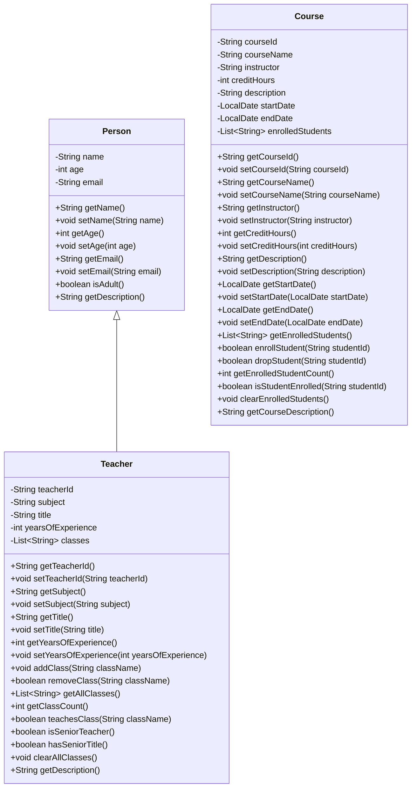

# 教师系统设计文档

## 1. 概述

### 1.1 系统目标
设计并实现一个教师管理系统，用于管理学校教师的基本信息、教学任务和相关资源。系统将提供教师信息维护、课程分配、教学管理等功能。

### 1.2 系统范围
本系统主要面向教育机构，用于管理教师相关信息，包括但不限于：
- 教师基本信息管理
- 教学任务分配
- 课程管理
- 教师资质和职称管理

## 2. 系统架构

### 2.1 技术栈
基于现有项目技术栈，系统将采用Java作为主要开发语言，利用已有的Person和Teacher类作为基础数据模型。

### 2.2 架构设计
系统采用面向对象设计，基于现有的类结构进行扩展：
- 继承现有Person类的基本属性和方法
- 扩展Teacher类以包含教师特有属性和功能
- 可能需要创建新的Course类来管理课程信息

## 3. 数据模型设计

### 3.1 类结构图

### 3.2 核心类说明

#### 3.2.1 Person类
作为基础类，包含人员的基本信息：
- 姓名(name)
- 年龄(age)
- 邮箱(email)

#### 3.2.2 Teacher类
继承自Person类，扩展教师特有属性：
- 教师ID(teacherId)
- 所教科目(subject)
- 职称(title)
- 教龄(yearsOfExperience)
- 授课班级列表(classes)

#### 3.2.3 Course类
表示课程信息：
- 课程ID(courseId)
- 课程名称(courseName)
- 授课教师(instructor)
- 学分(creditHours)
- 课程描述(description)
- 开始日期(startDate)
- 结束日期(endDate)
- 注册学生列表(enrolledStudents)

## 4. 功能模块设计

### 4.1 教师信息管理模块
负责教师基本信息的增删改查操作：
- 添加新教师
- 更新教师信息
- 查询教师信息
- 删除教师记录

### 4.2 教学任务管理模块
管理教师的教学任务和课程分配：
- 为教师分配课程
- 管理教师授课班级
- 查看教师教学任务

### 4.3 课程管理模块
管理学校开设的课程信息：
- 添加新课程
- 更新课程信息
- 查询课程信息
- 管理课程注册学生

## 5. 接口设计

### 5.1 教师管理接口

| 接口名称 | 方法签名 | 描述 |
|---------|---------|------|
| 添加教师 | `void addTeacher(Teacher teacher)` | 添加新教师到系统 |
| 更新教师 | `void updateTeacher(Teacher teacher)` | 更新教师信息 |
| 删除教师 | `void removeTeacher(String teacherId)` | 根据ID删除教师 |
| 查询教师 | `Teacher getTeacher(String teacherId)` | 根据ID查询教师 |
| 获取所有教师 | `List<Teacher> getAllTeachers()` | 获取所有教师列表 |

### 5.2 课程管理接口

| 接口名称 | 方法签名 | 描述 |
|---------|---------|------|
| 添加课程 | `void addCourse(Course course)` | 添加新课程到系统 |
| 更新课程 | `void updateCourse(Course course)` | 更新课程信息 |
| 删除课程 | `void removeCourse(String courseId)` | 根据ID删除课程 |
| 查询课程 | `Course getCourse(String courseId)` | 根据ID查询课程 |
| 获取所有课程 | `List<Course> getAllCourses()` | 获取所有课程列表 |

### 5.3 教学任务管理接口

| 接口名称 | 方法签名 | 描述 |
|---------|---------|------|
| 分配课程 | `void assignCourseToTeacher(String teacherId, String courseId)` | 为教师分配课程 |
| 移除课程 | `void removeCourseFromTeacher(String teacherId, String courseId)` | 移除教师的课程 |
| 获取教师课程 | `List<Course> getCoursesForTeacher(String teacherId)` | 获取教师的所有课程 |

## 6. 非功能性需求

### 6.1 性能需求
- 系统应能支持至少1000名教师的信息管理
- 查询响应时间不超过2秒

### 6.2 可靠性需求
- 系统应保证数据一致性
- 提供数据备份和恢复机制

### 6.3 安全性需求
- 教师敏感信息应进行适当保护
- 系统操作应有日志记录

## 7. 扩展性考虑

### 7.1 未来可能的扩展功能
- 教师绩效评估模块
- 教学资源管理
- 教师培训记录管理
- 教师薪资管理

### 7.2 系统集成
- 可与学生管理系统集成
- 可与课程安排系统集成
- 可与薪资管理系统集成- 可与课程安排系统集成
