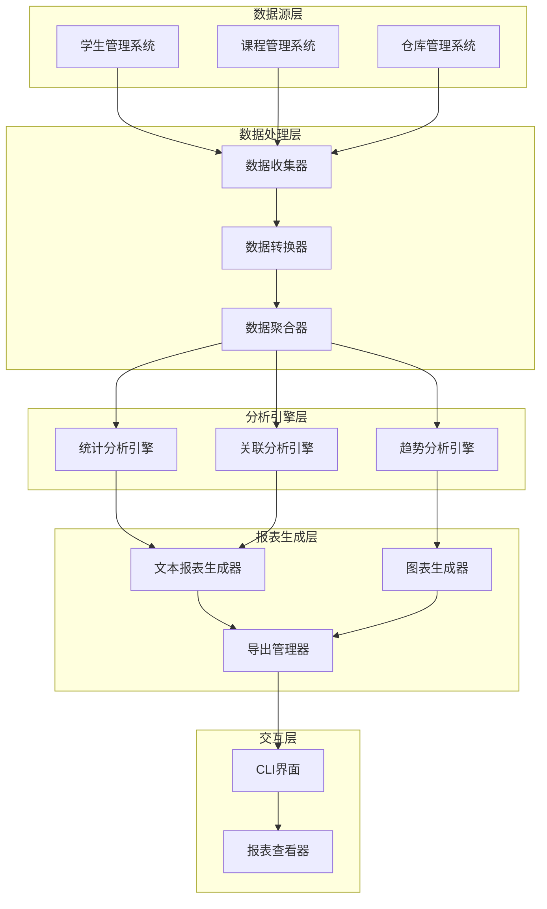
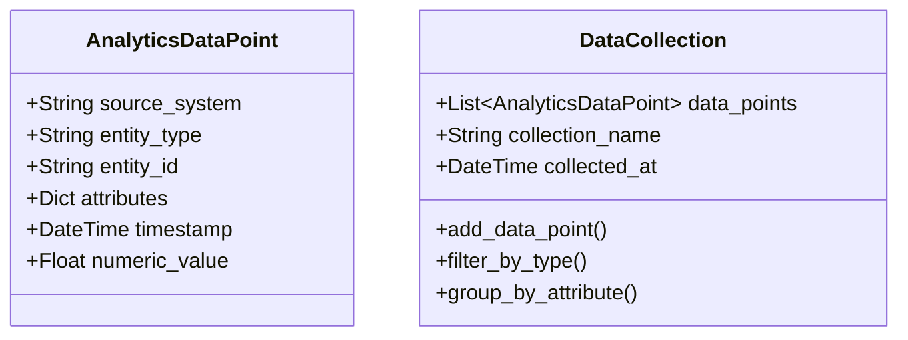
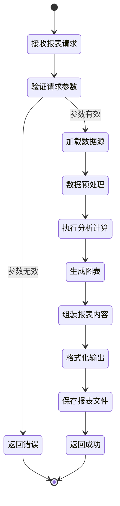
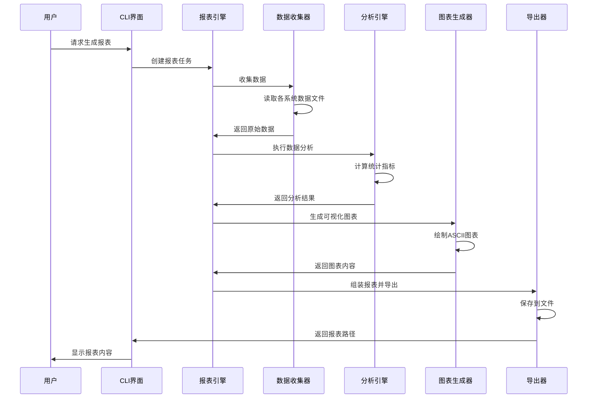

# 智能数据分析与可视化报表系统设计文档

## 1. 概述

### 1.1 项目背景
当前系统包含学生管理、课程管理和仓库管理三个独立模块,各模块数据分散,缺乏统一的数据分析和可视化能力。本系统旨在为现有管理系统提供强大的数据分析、统计报表和可视化展示功能。

### 1.2 核心价值
- **数据整合**:统一管理来自多个业务模块的数据
- **智能分析**:自动生成多维度统计分析报告
- **可视化展示**:通过图表直观展示数据趋势和分布
- **决策支持**:为管理者提供数据驱动的决策依据
- **导出能力**:支持多种格式的报表导出

### 1.3 技术约束
- 使用Python 3.6+标准库
- 不依赖外部第三方库
- 采用纯文本图表(ASCII Art)实现可视化
- 数据持久化采用JSON格式
- 命令行交互界面

## 2. 系统架构

### 2.1 整体架构



### 2.2 模块职责划分

| 模块名称 | 核心职责 | 输入 | 输出 |
|---------|---------|------|------|
| 数据收集器 | 从各业务系统读取原始数据 | 业务系统数据文件路径 | 标准化数据对象 |
| 数据转换器 | 将不同格式数据转换为统一格式 | 原始数据对象 | 统一数据模型 |
| 数据聚合器 | 按维度聚合统计数据 | 统一数据模型 | 聚合结果集 |
| 统计分析引擎 | 计算统计指标 | 聚合数据 | 统计结果 |
| 趋势分析引擎 | 分析时间序列趋势 | 时序数据 | 趋势报告 |
| 关联分析引擎 | 发现数据间关联关系 | 多维数据 | 关联报告 |
| 文本报表生成器 | 生成文本格式报表 | 分析结果 | Markdown/文本报表 |
| 图表生成器 | 生成ASCII字符图表 | 数值数据 | ASCII图表 |
| 导出管理器 | 管理报表导出 | 报表对象 | 文件(JSON/CSV/TXT) |

## 3. 核心功能设计

### 3.1 数据收集与整合

#### 3.1.1 数据源适配器设计

每个业务系统对应一个适配器,负责读取和解析该系统的数据:

| 适配器名称 | 数据源 | 提取字段 |
|-----------|--------|---------|
| StudentDataAdapter | students_data.json | 学生ID、姓名、年龄、专业、成绩列表、创建时间 |
| CourseDataAdapter | courses_data.json | 课程ID、课程名、教师、学分、容量、选课人数 |
| WarehouseDataAdapter | warehouse_data/ | 商品ID、商品名、类别、价格、库存量、交易记录 |

#### 3.1.2 统一数据模型

所有数据转换为标准化的分析数据结构:



### 3.2 统计分析功能

#### 3.2.1 学生成绩分析

| 分析维度 | 计算指标 | 用途 |
|---------|---------|------|
| 整体表现 | 平均分、中位数、标准差 | 评估整体学习水平 |
| 分数分布 | 优秀率、及格率、各分数段人数 | 了解成绩分布情况 |
| 科目对比 | 各科目平均分排名 | 识别强势/弱势科目 |
| 学生排名 | Top N 学生、进步幅度 | 激励优秀学生 |
| 趋势分析 | 按时间维度的成绩变化 | 跟踪学习进度 |

#### 3.2.2 课程运营分析

| 分析维度 | 计算指标 | 用途 |
|---------|---------|------|
| 选课情况 | 选课率、满员率 | 评估课程热度 |
| 教师负荷 | 每位教师授课数、学生数 | 平衡教学资源 |
| 学分分布 | 各学分段课程数量 | 优化课程结构 |
| 容量利用 | 平均选课率、空置率 | 调整课程容量 |

#### 3.2.3 仓库库存分析

| 分析维度 | 计算指标 | 用途 |
|---------|---------|------|
| 库存状态 | 总库存量、库存价值、周转率 | 评估库存健康度 |
| 商品分类 | 各类别库存占比 | 优化品类结构 |
| 预警统计 | 低库存商品数、即将过期商品数 | 及时补货处理 |
| 交易分析 | 入库/出库频次、高频商品 | 识别畅销品 |

### 3.3 可视化图表设计

#### 3.3.1 柱状图(Bar Chart)

用于展示分类数据的对比:

**展示场景**:
- 各科目平均分对比
- 各课程选课人数对比
- 各类别商品库存对比

**设计规格**:
- 采用ASCII字符绘制
- 支持横向和纵向布局
- 自动计算比例尺
- 显示数值标签

#### 3.3.2 折线图(Line Chart)

用于展示时间序列数据的趋势:

**展示场景**:
- 学生成绩变化趋势
- 课程选课人数变化
- 库存量变化曲线

**设计规格**:
- 使用字符绘制坐标轴
- 标记关键数据点
- 支持多条线对比
- 显示峰值和谷值

#### 3.3.3 饼图(Pie Chart)

用于展示占比关系:

**展示场景**:
- 成绩等级分布
- 课程学分分布
- 商品类别占比

**设计规格**:
- 文字形式表示百分比
- 按占比排序显示
- 标注具体数值和比例

### 3.4 报表生成流程



### 3.5 报表类型定义

| 报表类型 | 内容组成 | 生成频率 | 输出格式 |
|---------|---------|---------|---------|
| 学生成绩综合报表 | 整体统计+排名+分布图 | 每学期 | TXT/CSV |
| 课程运营报表 | 选课统计+教师负荷+容量分析 | 每月 | TXT/CSV |
| 库存状态报表 | 库存总览+预警清单+周转率 | 每周 | TXT/CSV |
| 对比分析报表 | 跨系统数据对比+趋势图 | 按需 | TXT |
| 自定义报表 | 用户指定指标+维度 | 按需 | TXT/JSON |

## 4. 数据流设计

### 4.1 报表生成数据流



### 4.2 数据更新机制

**触发条件**:
- 定时刷新:每小时自动更新统计数据
- 事件触发:业务系统数据变更时更新
- 手动刷新:用户主动请求更新

**更新流程**:
1. 检测数据源文件修改时间
2. 仅重新加载变更的数据源
3. 增量更新分析结果缓存
4. 标记已生成报表为过期
5. 通知用户数据已更新

## 5. 接口设计

### 5.1 CLI命令接口

| 命令 | 参数 | 功能说明 | 示例 |
|------|------|---------|------|
| generate-report | --type, --format, --output | 生成指定类型报表 | generate-report --type=student --format=txt |
| show-stats | --system, --metric | 显示统计数据 | show-stats --system=student --metric=average |
| export-data | --source, --format, --output | 导出原始数据 | export-data --source=all --format=csv |
| compare | --systems, --metric | 跨系统对比分析 | compare --systems=student,course |
| refresh-data | --source | 刷新数据缓存 | refresh-data --source=all |

### 5.2 报表引擎API

**核心接口**:

| 方法名 | 参数 | 返回值 | 说明 |
|-------|------|--------|------|
| create_report | report_type, options | Report对象 | 创建报表实例 |
| add_section | section_name, content | 无 | 添加报表章节 |
| add_chart | chart_type, data | 无 | 添加图表 |
| render | format_type | String | 渲染报表内容 |
| save | file_path | Boolean | 保存报表到文件 |

**数据收集接口**:

| 方法名 | 参数 | 返回值 | 说明 |
|-------|------|--------|------|
| collect_student_data | file_path | List[Student] | 收集学生数据 |
| collect_course_data | file_path | List[Course] | 收集课程数据 |
| collect_warehouse_data | dir_path | List[Product] | 收集仓库数据 |
| merge_data_sources | sources | DataCollection | 合并数据源 |

## 6. 核心算法设计

### 6.1 统计算法

#### 6.1.1 基本统计量计算

**平均值(Mean)**:
- 输入:数值列表
- 输出:平均值
- 算法:求和后除以数量

**中位数(Median)**:
- 输入:数值列表
- 输出:中位数
- 算法:排序后取中间值或中间两值的平均

**标准差(Standard Deviation)**:
- 输入:数值列表
- 输出:标准差
- 算法:计算方差的平方根

#### 6.1.2 分布分析算法

**分组统计**:
- 将数据按区间分组
- 计算每组的频数和频率
- 识别众数区间

**百分位计算**:
- 排序数据
- 计算指定百分位的值
- 用于识别优秀/及格线

### 6.2 图表绘制算法

#### 6.2.1 柱状图绘制算法

**步骤**:
1. 计算最大值和最小值
2. 确定纵轴刻度和比例
3. 计算每个柱子的高度(字符行数)
4. 从上到下逐行输出字符
5. 添加坐标轴和标签

**比例计算**:
- 可用高度:40个字符行
- 比例因子 = 可用高度 / (最大值 - 最小值)
- 柱高 = (数值 - 最小值) × 比例因子

#### 6.2.2 折线图绘制算法

**步骤**:
1. 归一化数据到画布范围
2. 计算每个数据点的坐标
3. 用字符标记数据点
4. 绘制连接线(使用字符近似)
5. 添加坐标轴和图例

**平滑处理**:
- 使用移动平均法平滑曲线
- 窗口大小:3个数据点
- 保留原始数据点标记

### 6.3 趋势分析算法

#### 6.3.1 简单移动平均(SMA)

**目的**:平滑数据,识别趋势

**计算方法**:
- 窗口大小:可配置(默认5)
- 对窗口内数据求平均
- 滑动窗口遍历全部数据

#### 6.3.2 趋势判断

**判断标准**:
- 上升趋势:连续N个点递增
- 下降趋势:连续N个点递减
- 平稳:波动小于阈值

**参数**:
- 连续点数N:3
- 波动阈值:平均值的5%

## 7. 数据模型设计

### 7.1 报表数据模型

| 字段名 | 类型 | 说明 | 示例 |
|-------|------|------|------|
| report_id | String | 报表唯一标识 | RPT-20240315-001 |
| report_type | String | 报表类型 | student_performance |
| title | String | 报表标题 | 2024春季学生成绩报表 |
| generated_at | DateTime | 生成时间 | 2024-03-15 10:30:00 |
| data_range | Dict | 数据时间范围 | {start: ..., end: ...} |
| sections | List[Section] | 报表章节列表 | [{name: ..., content: ...}] |
| charts | List[Chart] | 图表列表 | [{type: ..., data: ...}] |
| metadata | Dict | 元数据 | {author: ..., version: ...} |

### 7.2 图表数据模型

| 字段名 | 类型 | 说明 | 示例 |
|-------|------|------|------|
| chart_id | String | 图表ID | CHT-001 |
| chart_type | String | 图表类型 | bar/line/pie |
| title | String | 图表标题 | 各科目平均分对比 |
| data | List/Dict | 图表数据 | {labels: [...], values: [...]} |
| options | Dict | 显示选项 | {width: 60, height: 20} |
| rendered_content | String | 渲染后的ASCII内容 | 字符图表文本 |

### 7.3 分析结果模型

| 字段名 | 类型 | 说明 |
|-------|------|------|
| metric_name | String | 指标名称 |
| metric_value | Float | 指标值 |
| comparison_baseline | Float | 对比基准值 |
| change_rate | Float | 变化率(%) |
| trend | String | 趋势(up/down/stable) |
| interpretation | String | 结果解读 |

## 8. 配置管理

### 8.1 系统配置参数

| 配置项 | 默认值 | 说明 |
|-------|--------|------|
| data_refresh_interval | 3600 | 数据刷新间隔(秒) |
| chart_max_width | 80 | 图表最大宽度(字符) |
| chart_max_height | 40 | 图表最大高度(行) |
| report_output_dir | ./reports/ | 报表输出目录 |
| cache_enabled | true | 是否启用缓存 |
| cache_ttl | 1800 | 缓存有效期(秒) |
| log_level | INFO | 日志级别 |

### 8.2 报表模板配置

**配置文件结构**:
```
{
  "template_name": "student_report",
  "sections": [
    {
      "name": "基本统计",
      "metrics": ["total_students", "average_score", "pass_rate"],
      "include_chart": true,
      "chart_type": "bar"
    },
    {
      "name": "成绩分布",
      "metrics": ["score_distribution"],
      "include_chart": true,
      "chart_type": "pie"
    }
  ]
}
```

## 9. 异常处理策略

### 9.1 数据加载异常

| 异常类型 | 处理策略 | 用户提示 |
|---------|---------|---------|
| 文件不存在 | 使用空数据集,记录警告 | 数据源文件未找到,将使用空数据 |
| 文件格式错误 | 跳过该数据源,继续处理 | 数据格式错误,已跳过 |
| 数据字段缺失 | 使用默认值填充 | 部分字段缺失,已使用默认值 |
| 数据类型不匹配 | 尝试类型转换,失败则跳过 | 数据类型转换失败,该记录已忽略 |

### 9.2 计算异常

| 异常类型 | 处理策略 | 用户提示 |
|---------|---------|---------|
| 除零错误 | 返回0或None | 计算失败:除数为零 |
| 数据为空 | 返回默认统计值 | 无数据可分析 |
| 数值溢出 | 使用科学计数法 | 数值过大,已转为科学计数 |

### 9.3 报表生成异常

| 异常类型 | 处理策略 | 用户提示 |
|---------|---------|---------|
| 磁盘空间不足 | 清理旧报表后重试 | 磁盘空间不足,已清理缓存 |
| 文件写入失败 | 重试3次,失败则返回内存内容 | 保存失败,报表仅在内存中 |
| 图表渲染失败 | 跳过图表,仅输出文本 | 图表生成失败,已省略 |

## 10. 性能优化策略

### 10.1 数据处理优化

**策略**:
- 批量读取:一次性读取所有需要的数据文件
- 懒加载:仅在需要时计算统计指标
- 缓存机制:缓存计算结果,避免重复计算
- 增量更新:仅处理变更的数据

**预期效果**:
- 数据加载时间 < 2秒
- 报表生成时间 < 5秒
- 内存占用 < 100MB

### 10.2 缓存策略

| 缓存对象 | 缓存键 | 失效条件 | TTL |
|---------|--------|---------|-----|
| 原始数据 | data_source_name | 文件修改时间变化 | 30分钟 |
| 统计结果 | metric_name + params | 数据更新 | 15分钟 |
| 图表内容 | chart_id | 数据更新 | 10分钟 |
| 完整报表 | report_id | 数据更新或手动刷新 | 1小时 |

## 11. 测试策略

### 11.1 单元测试

**测试模块**:
- 数据收集器:验证各数据源读取正确性
- 统计算法:验证计算结果准确性
- 图表生成:验证图表格式正确性
- 报表组装:验证报表结构完整性

**测试覆盖目标**:
- 代码覆盖率 > 80%
- 核心算法覆盖率 100%

### 11.2 集成测试场景

| 场景 | 测试目标 | 验证点 |
|------|---------|--------|
| 完整报表生成 | 端到端流程 | 数据正确、格式规范、文件保存成功 |
| 多数据源整合 | 跨系统数据整合 | 数据关联正确、无冲突 |
| 异常数据处理 | 容错能力 | 不崩溃、有提示、降级处理 |
| 大数据量处理 | 性能表现 | 时间和内存在可接受范围 |

### 11.3 测试数据准备

**学生数据**:
- 正常数据:100名学生,每人5-8门课程
- 边界数据:0分、100分、无成绩学生
- 异常数据:负分、超100分、非数值成绩

**课程数据**:
- 正常数据:20门课程,选课率20%-100%
- 边界数据:空课程、满员课程
- 异常数据:容量为0、负数学分

**仓库数据**:
- 正常数据:50种商品,库存0-1000
- 边界数据:零库存、临期商品
- 异常数据:负库存、过期商品
