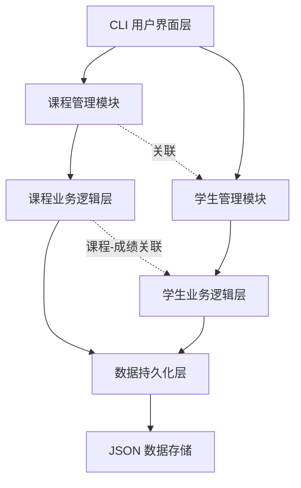
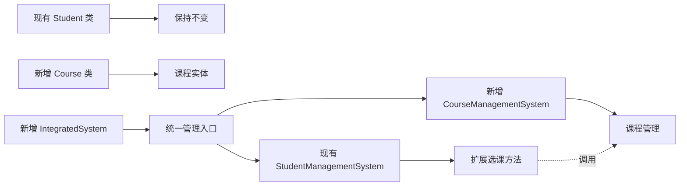
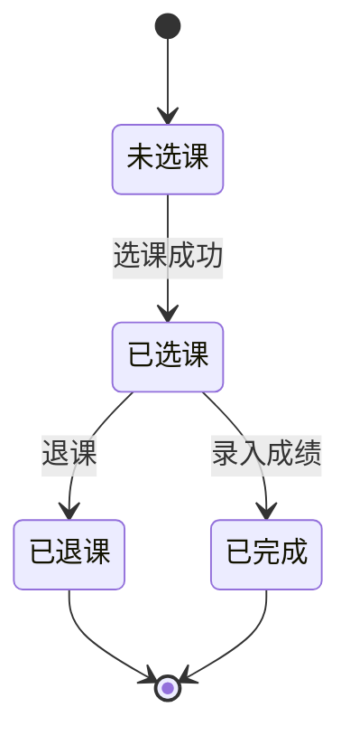
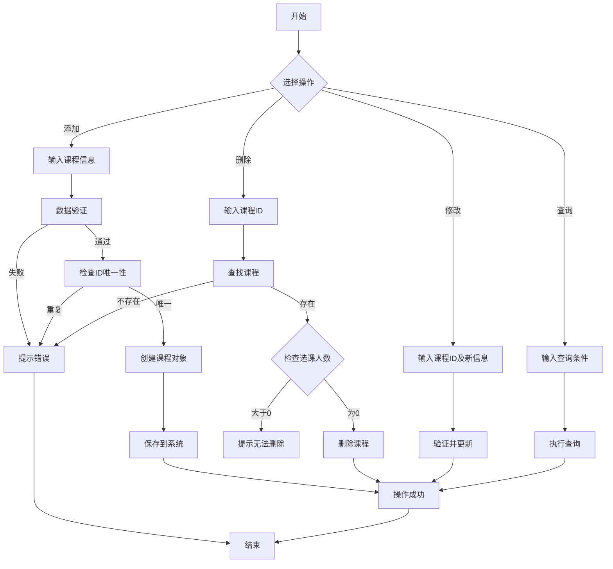
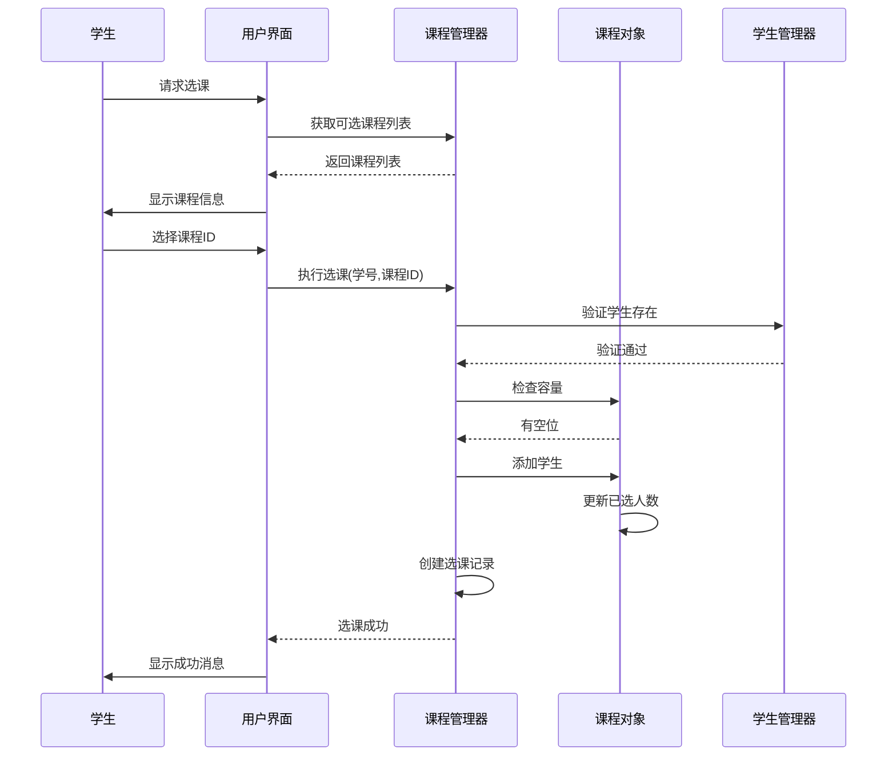
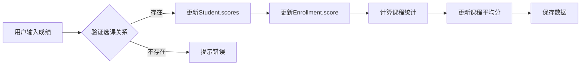
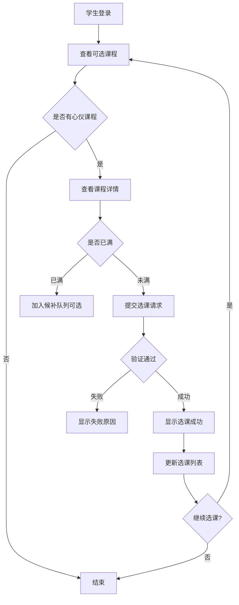

# 课程管理与选课功能模块设计文档

## 1. 概述

### 1.1 设计目标

在现有学生管理系统基础上,扩展课程管理和选课功能,使系统能够支持完整的教学管理场景。本模块将实现课程信息管理、学生选课、课程成绩关联、课程统计分析等核心功能。

### 1.2 设计价值

- **业务完整性**:将学生、课程、成绩三者有机结合,构建完整的教学管理闭环
- **数据关联性**:通过课程ID关联学生成绩,使成绩数据更加结构化和规范化
- **统计分析**:提供课程维度的统计分析,如选课人数、课程平均分、优秀率等
- **可扩展性**:为后续教师管理、排课系统等功能预留接口

### 1.3 适用场景

- 培训机构的课程管理
- 学校的选课系统
- 在线教育平台的课程组织
- 企业培训的课程安排

## 2. 系统架构

### 2.1 整体架构设计

系统采用分层架构,在现有学生管理系统基础上新增课程管理层:



### 2.2 模块划分

| 模块名称 | 职责描述 | 核心对象 |
|---------|---------|---------|
| 课程模型层 | 定义课程实体及其属性和行为 | Course 类 |
| 课程管理层 | 提供课程的增删改查、选课退课等业务逻辑 | CourseManagementSystem 类 |
| 选课关联层 | 管理学生与课程的多对多关系 | Enrollment 类 |
| 数据集成层 | 整合学生、课程、成绩数据 | IntegratedDataManager 类 |
| 用户界面层 | 提供课程管理的CLI交互界面 | CourseCLI 类 |

### 2.3 与现有系统的集成



## 3. 数据模型设计

### 3.1 课程实体模型

课程作为核心实体,包含以下属性和行为:

| 属性名称 | 数据类型 | 说明 | 约束条件 |
|---------|---------|------|---------|
| course_id | String | 课程唯一标识 | 必填,格式:CS001 |
| course_name | String | 课程名称 | 必填,长度2-50字符 |
| teacher | String | 授课教师 | 必填 |
| credit | Float | 学分 | 必填,范围0.5-10.0 |
| capacity | Integer | 课程容量 | 必填,范围1-500 |
| enrolled_count | Integer | 已选课人数 | 系统自动维护 |
| description | String | 课程描述 | 可选 |
| semester | String | 开课学期 | 如:2024春季 |
| schedule | String | 上课时间 | 如:周一3-4节 |
| created_time | DateTime | 创建时间 | 系统自动生成 |

#### 课程行为定义

| 行为方法 | 输入参数 | 输出结果 | 业务规则 |
|---------|---------|---------|---------|
| 添加选课学生 | 学号 | 成功/失败 | 检查容量限制 |
| 移除选课学生 | 学号 | 成功/失败 | 更新已选人数 |
| 检查是否已满 | 无 | 布尔值 | enrolled_count >= capacity |
| 获取选课学生列表 | 无 | 学号列表 | 返回所有已选课学生 |
| 获取课程统计信息 | 无 | 统计字典 | 选课率、平均分等 |

### 3.2 选课关联模型

学生与课程的多对多关联关系:

| 属性名称 | 数据类型 | 说明 |
|---------|---------|------|
| student_id | String | 学生学号 |
| course_id | String | 课程编号 |
| enrollment_time | DateTime | 选课时间 |
| status | String | 选课状态:正常/已退课 |
| score | Float | 课程成绩(可选) |

#### 选课状态流转



### 3.3 数据存储结构

基于现有JSON存储方式扩展:

```
数据存储结构示意(自然语言描述):

courses_data.json 文件结构:
{
  "courses": {
    "课程ID1": {
      课程基本信息字段,
      已选学生列表,
      元数据信息
    },
    "课程ID2": { ... }
  },
  "enrollments": {
    "学号_课程ID": {
      选课关联信息,
      选课时间,
      成绩等
    }
  },
  "metadata": {
    总课程数,
    最后更新时间,
    数据版本号
  }
}

与现有 students_data.json 分离存储,通过课程ID关联
```

## 4. 功能模块设计

### 4.1 课程管理功能

#### 4.1.1 课程信息管理

| 功能点 | 业务逻辑描述 | 验证规则 |
|-------|------------|---------|
| 添加课程 | 创建新课程记录,初始化选课人数为0 | 课程ID唯一性检查,必填字段验证 |
| 删除课程 | 检查是否有学生选课,仅允许删除无人选课程 | 已选人数=0时才能删除 |
| 修改课程 | 更新课程信息,不允许修改课程ID | 容量减少时需检查已选人数 |
| 查询课程 | 按课程ID、名称、教师等条件查询 | 支持模糊匹配 |
| 列出所有课程 | 获取系统内全部课程列表 | 支持排序(按ID、名称、选课人数) |

#### 4.1.2 课程信息管理流程



### 4.2 选课管理功能

#### 4.2.1 选课业务逻辑

| 功能点 | 前置条件 | 业务规则 | 后置处理 |
|-------|---------|---------|---------|
| 学生选课 | 学生和课程都存在 | 1. 检查课程容量限制<br>2. 检查是否重复选课<br>3. 可选:检查时间冲突 | 更新课程已选人数<br>创建选课关联记录 |
| 学生退课 | 已选过该课程 | 1. 检查是否已有成绩<br>2. 是否在退课期限内(可选) | 减少课程已选人数<br>更新选课状态 |
| 查看选课列表 | 学生存在 | 按学期或全部查询 | 返回课程详细信息列表 |
| 查看课程学生 | 课程存在 | 获取选课学生 | 返回学生基本信息列表 |

#### 4.2.2 选课流程设计



### 4.3 成绩关联功能

将现有成绩系统与课程系统关联:

#### 4.3.1 成绩录入规则

| 规则项 | 描述 | 实施方式 |
|-------|------|---------|
| 选课前提 | 只能为已选课程录入成绩 | 检查enrollments表中是否存在对应记录 |
| 成绩覆盖 | 允许修改已录入成绩 | 更新选课记录中的score字段 |
| 成绩删除 | 删除成绩不影响选课状态 | 将score字段置为空 |
| 数据同步 | 成绩数据同时存储在学生对象和选课记录中 | 双向同步机制 |

#### 4.3.2 成绩数据流



### 4.4 统计分析功能

#### 4.4.1 课程统计指标

| 统计项 | 计算方法 | 用途 |
|-------|---------|------|
| 选课率 | 已选人数 / 课程容量 × 100% | 评估课程热度 |
| 课程平均分 | 所有已选学生该课程成绩的平均值 | 评估课程难度和教学效果 |
| 优秀率 | 成绩≥85分人数 / 总人数 × 100% | 教学质量指标 |
| 及格率 | 成绩≥60分人数 / 总人数 × 100% | 基础达标率 |
| 分数段分布 | 统计各分数段人数 | 成绩分布分析 |

#### 4.4.2 学生选课统计

| 统计项 | 计算方法 | 用途 |
|-------|---------|------|
| 选课总数 | 学生已选课程数量 | 学习负担评估 |
| 总学分 | 所选课程学分之和 | 毕业要求检查 |
| 已获学分 | 已通过课程学分之和 | 学业进度跟踪 |
| 平均绩点 | 根据成绩和学分加权计算GPA | 学业表现综合评价 |

## 5. 用户交互设计

### 5.1 菜单结构设计

扩展现有CLI菜单,新增课程管理板块:

```
主菜单结构:
├── 1. 学生管理(保持原有功能)
├── 2. 课程管理(新增)
│   ├── 2.1 课程信息管理
│   │   ├── 添加课程
│   │   ├── 删除课程
│   │   ├── 修改课程
│   │   ├── 查询课程
│   │   └── 列出所有课程
│   ├── 2.2 选课管理
│   │   ├── 学生选课
│   │   ├── 学生退课
│   │   ├── 查看学生选课列表
│   │   └── 查看课程学生名单
│   └── 2.3 课程统计
│       ├── 课程选课统计
│       ├── 课程成绩分析
│       └── 学生选课汇总
├── 3. 成绩管理(原有功能,增强课程关联)
├── 4. 查询统计(保持原有功能)
└── 5. 数据管理(扩展课程数据)
```

### 5.2 用户操作流程示例

#### 5.2.1 完整选课流程



### 5.3 界面交互示例

#### 添加课程交互流程

```
操作步骤说明(自然语言):

1. 系统提示: "请输入课程编号(格式:CS001):"
   用户输入: CS101
   系统验证: 格式正确,未重复

2. 系统提示: "请输入课程名称:"
   用户输入: 数据结构与算法
   系统验证: 长度符合要求

3. 系统提示: "请输入授课教师:"
   用户输入: 张教授

4. 系统提示: "请输入学分(0.5-10.0):"
   用户输入: 3.0
   系统验证: 数值范围正确

5. 系统提示: "请输入课程容量:"
   用户输入: 60
   系统验证: 正整数

6. 系统创建课程对象并保存
   反馈消息: "✓ 课程添加成功! 课程ID: CS101"
```

## 6. 数据验证规则

### 6.1 课程数据验证

| 验证项 | 验证规则 | 错误提示 |
|-------|---------|---------|
| 课程ID | 格式:2-3个大写字母 + 3位数字,如CS101 | "课程ID格式错误,应为字母+数字组合" |
| 课程名称 | 长度2-50字符,不能为空 | "课程名称长度应在2-50字符之间" |
| 学分 | 数值类型,范围0.5-10.0 | "学分应在0.5-10.0之间" |
| 容量 | 正整数,范围1-500 | "课程容量应在1-500之间" |
| 学期 | 格式:年份+季节,如2024春季 | "学期格式不正确" |

### 6.2 选课数据验证

| 验证项 | 验证规则 | 业务约束 |
|-------|---------|---------|
| 学生存在性 | 学号在学生系统中存在 | 必须先注册学生 |
| 课程存在性 | 课程ID在课程系统中存在 | 必须先创建课程 |
| 重复选课 | 同一学生不能重复选择同一课程 | 检查选课记录 |
| 容量限制 | 已选人数 < 课程容量 | 满员时拒绝选课 |
| 时间冲突 | 可选:检查课程时间是否冲突 | 增强功能 |

## 7. 测试策略

### 7.1 单元测试范围

| 测试模块 | 测试要点 | 预期结果 |
|---------|---------|---------|
| Course类 | 课程创建、属性设置、学生管理 | 所有方法正常工作 |
| CourseManagementSystem | 课程CRUD操作、选课退课逻辑 | 业务规则正确执行 |
| 数据验证器 | 各类输入验证规则 | 正确识别合法/非法输入 |
| 数据持久化 | 课程数据保存和加载 | 数据完整性保持 |
| 集成测试 | 学生-课程-成绩联动 | 数据关联正确 |

### 7.2 测试用例设计

#### 选课功能测试用例表

| 用例ID | 测试场景 | 输入数据 | 预期结果 |
|-------|---------|---------|---------|
| TC-01 | 正常选课 | 有效学号,未满课程 | 选课成功 |
| TC-02 | 重复选课 | 已选过的课程 | 提示已选,拒绝 |
| TC-03 | 满员课程 | 已满课程 | 提示已满,拒绝 |
| TC-04 | 无效学号 | 不存在的学号 | 提示学号不存在 |
| TC-05 | 无效课程 | 不存在的课程ID | 提示课程不存在 |
| TC-06 | 退课操作 | 已选课程 | 退课成功,更新人数 |
| TC-07 | 退已有成绩的课 | 有成绩的课程 | 根据规则允许或拒绝 |
